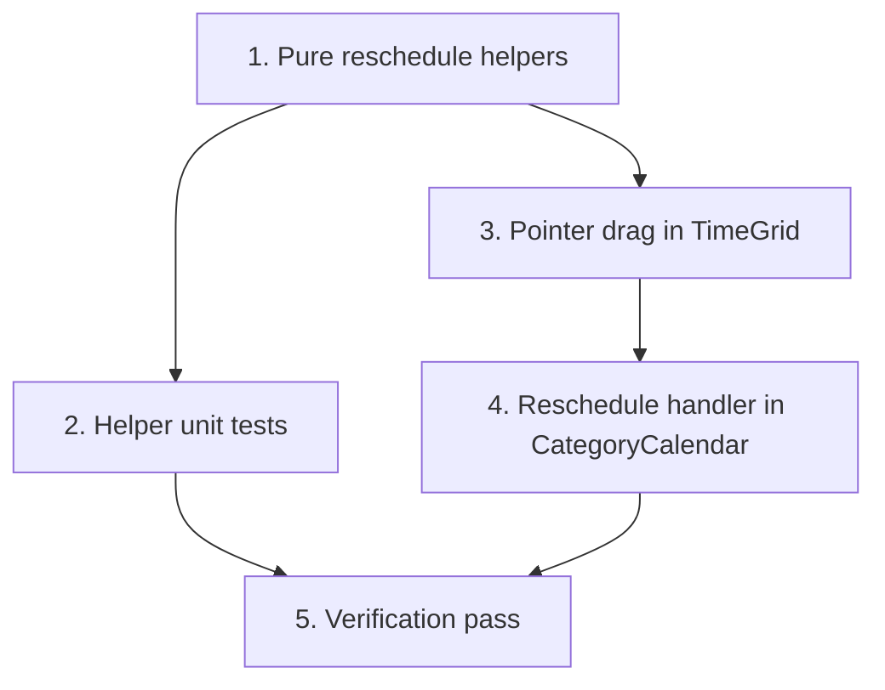

# Implementation Plan

## Overview

No backend or schema changes — reschedule reuses the existing update endpoint
and the no-overlap rule. Work flows: pure reschedule helpers (with unit tests) →
pointer-drag in TimeGrid → the reschedule handler in CategoryCalendar →
verification. The snap/duration math is pure and unit-tested; the drag wiring is
a thin interaction layer over it.

## Task Dependency Graph



```json
{
  "waves": [
    { "wave": 1, "tasks": ["1"] },
    { "wave": 2, "tasks": ["2", "3"] },
    { "wave": 3, "tasks": ["4"] },
    { "wave": 4, "tasks": ["5"] }
  ]
}
```

## Tasks

### Phase 1 — Pure logic

- [ ] 1. Add reschedule helpers to `src/lib/calendar.ts`
  - Add `snapMinutes(minute, increment = 15)` (nearest multiple, clamped to `[0, 1440]`) and `computeRescheduledSchedule(event, targetDay, targetStartMinute, increment = 15): { startAt: Date; endAt: Date | null }`. Preserve duration (`endAt - startAt`, or `null`); new start = `targetDay` local-midnight + snapped minute; clamp start to `[0, 1440 - durationMinutes]` for ranged events and `[0, 1440)` for point events; keep `endAt` null when the event had none.
  - _Requirements: 1.1, 1.3, 5.3_

### Phase 2 — Coverage and interaction

- [ ] 2. Unit-test the reschedule helpers
  - Extend `src/lib/calendar.test.ts`: `snapMinutes` (rounds to nearest 15, exact multiples unchanged, clamps below 0 and above 1440); `computeRescheduledSchedule` (ranged event keeps its duration; point event keeps `endAt` null; changing `targetDay` sets the new date; start snapped; a long event near end-of-day clamps so it does not pass midnight).
  - _Requirements: 1.1, 1.3, 5.3_

- [ ] 3. Add pointer-drag to the TimeGrid
  - In `src/components/calendar/time-grid.tsx`, add optional `onReschedule?(event, newStartAt: Date, newEndAt: Date | null)`. When present, timed blocks handle Pointer Events: `pointerdown` (record origin, `setPointerCapture`), `pointermove` (enter drag past a ~4px threshold; show a follow-the-pointer preview, allowing cross-column movement in week view), `pointerup` (below threshold → `onPeek` as a click; else resolve the target day column via each column's ref/`getBoundingClientRect` and the target minute from `clientY`, then call `computeRescheduledSchedule` and `onReschedule`). All-day blocks stay static; when `onReschedule` is absent, behavior is unchanged.
  - _Requirements: 1.1, 1.2, 1.4, 1.5, 4.1, 4.2, 4.3_

### Phase 3 — Wiring

- [ ] 4. Add the reschedule handler in CategoryCalendar
  - In `src/components/calendar/category-calendar.tsx`, add `handleReschedule(event, newStartAt, newEndAt)`: optimistically replace the event's `startAt`/`endAt` in local `events` state; `PATCH /api/planning-items/${event.id}` with `{ startAt: iso, endAt: iso | null }`; on `!res.ok` restore the snapshot and `toast.error(await errorMessage(...))`; on success keep the optimistic state. Pass `onReschedule={handleReschedule}` to `<TimeGrid>` for week and day views only.
  - _Requirements: 2.1, 2.2, 3.1, 3.2, 3.3, 5.1, 5.2_

### Phase 4 — Verification

- [ ] 5. Full verification pass
  - `pnpm build`, `pnpm test`, `pnpm lint`, `pnpm exec tsc --noEmit` all green (clear `.next` if a stale route type error appears). Manual smoke test: drag within a day changes the time (snaps to 15m); drag across columns in week view changes the day; a tiny move opens details (click); dropping onto an occupied slot reverts with the conflict toast; a valid drop persists across a reload; month/agenda and all-day are not draggable.
  - _Requirements: 1.1, 1.2, 2.1, 3.1, 3.2, 4.2, 4.3_

## Notes

- **No backend/schema changes**: reuses `PATCH /api/planning-items/[id]` and the
  no-overlap rule (which excludes the item being updated).
- **Testability**: `snapMinutes`/`computeRescheduledSchedule` are pure and
  unit-tested; the pointer-drag wiring is a thin interaction layer (no React
  interaction test framework yet — verified manually).
- **Click vs drag**: a movement threshold (~4px) distinguishes a click (open
  details) from a drag (reschedule) so both coexist on the same block.
- **Workflow**: committed directly to `main` (no branch/PR) per the current
  request. Conventional commits, no AI attribution; keep the suite green.
- **Numbering** follows the dependency waves.
