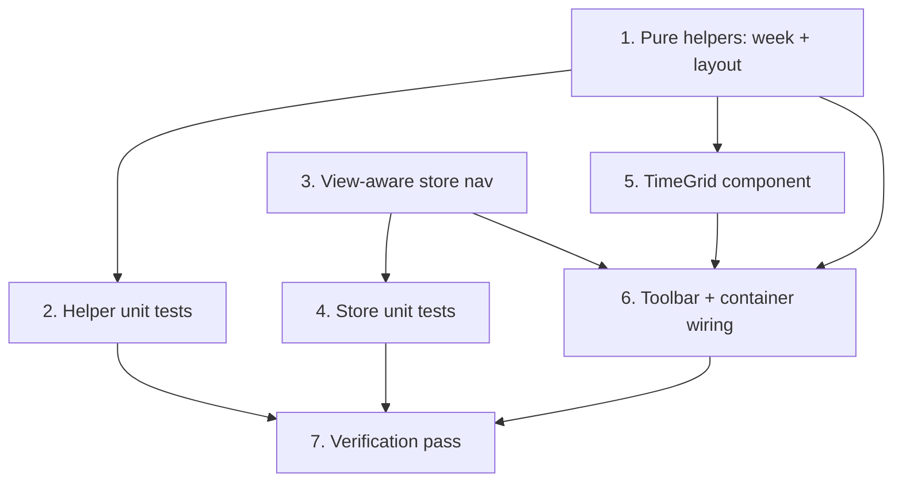

# Implementation Plan

## Overview

No backend or schema changes — week/day views are a new rendering over the
existing range endpoint and store. Work flows: pure helpers (with unit tests) →
view-aware store nav (with tests) → the TimeGrid component → toolbar + container
wiring → verification. The overlap-lane layout and week/range math live in pure
functions, so behavior is proven by tests; the components stay thin.

## Task Dependency Graph



```json
{
  "waves": [
    { "wave": 1, "tasks": ["1", "3"] },
    { "wave": 2, "tasks": ["2", "4", "5"] },
    { "wave": 3, "tasks": ["6"] },
    { "wave": 4, "tasks": ["7"] }
  ]
}
```

## Tasks

### Phase 1 — Pure logic and state

- [ ] 1. Add week/day helpers and the day layout to `src/lib/calendar.ts`
  - Add `startOfWeek(date, weekStartsOn?)`, `buildWeekDays(anchor, weekStartsOn?)`, and `layoutDayEvents(events, day): DayLayout` with `PositionedEvent`/`DayLayout` types. Extend `rangeFor` for `"week"` (`[startOfWeek, +7d)`) and `"day"` (`[startOfDay, +1d)`). Layout: split all-day vs timed; clamp timed to `[0,1440]`; enforce `MIN_EVENT_MINUTES` (30); assign overlap lanes (sort by start then end, form overlap clusters, greedy lane fill, `lanes` = max concurrency).
  - _Requirements: 1.1, 1.2, 1.3, 2.1, 2.2, 3.1, 3.2, 5.1_

- [ ] 3. Make store navigation view-aware in `src/stores/calendar-store.ts`
  - Extend `CalendarView` to include `"week"` and `"day"`. Replace `goToPrevMonth`/`goToNextMonth` with `goToPrev()`/`goToNext()` that shift `anchorDate` by month/week/day per the active `view` (agenda → ±7 days). Keep `setView`, `goToToday`.
  - _Requirements: 4.1, 4.2, 4.3, 4.4_

### Phase 2 — Coverage and the grid component

- [ ] 2. Unit-test the new helpers
  - Extend `src/lib/calendar.test.ts`: `startOfWeek`/`buildWeekDays` (7 contiguous week-start-aligned days for weekStartsOn 0 and 1, across month/year boundaries); `rangeFor` week/day windows (`from < to`); `layoutDayEvents` (all-day separated from timed; events spilling across midnight clamped to `[0,1440]`; missing/zero `endAt` gets `MIN_EVENT_MINUTES`; lane assignment for non-overlapping (all lane 0, lanes 1), fully overlapping (distinct lanes, lanes = N), and partial-overlap sets; every event `0 <= lane < lanes`).
  - _Requirements: 1.1, 1.3, 2.1, 2.2, 3.1, 3.2, 4.2, 5.1_

- [ ] 4. Unit-test the view-aware navigation
  - Extend `src/stores/calendar-store.test.ts`: `goToPrev`/`goToNext` shift by one month in month view, 7 days in week view, one day in day view (including week crossing a month boundary and day crossing a week/month boundary); `goToToday` and `setView` still work.
  - _Requirements: 4.1, 4.2, 4.3_

- [ ] 5. Build the TimeGrid component
  - Add `src/components/calendar/time-grid.tsx` (client, props `days: Date[]`, `events`, `onPeek?`): left hour-axis gutter (00–23), one column per day, an all-day strip on top, and a scrollable hour body (`HOUR_HEIGHT`). Render each day's `layoutDayEvents` timed events as absolutely-positioned read-only buttons (top/height from minutes, left/width from lane/lanes) that call `onPeek`; all-day events as chips in the strip. Draw a now-indicator line on today's column (a 1-minute `setInterval`, cleared on unmount) and distinguish today. Auto-scroll to ~07:00 on mount. Local time formatting.
  - _Requirements: 1.2, 1.4, 1.5, 2.1, 3.1, 6.1, 6.2, 7.1, 7.2, 7.3, 7.4_

### Phase 3 — Wiring

- [ ] 6. Wire the toolbar and container for week/day
  - `calendar-toolbar.tsx`: add Week and Day to the view toggle; prev/next call `goToPrev`/`goToNext`; adapt the title per view (month name / week range / day). `category-calendar.tsx`: render `<TimeGrid days={buildWeekDays(anchorDate)} …/>` for week and `<TimeGrid days={[startOfDay(anchorDate)]} …/>` for day, reusing the existing range fetch and DetailSheet `onPeek`.
  - _Requirements: 1.1, 4.1, 4.2, 4.5, 5.1, 5.2, 5.3, 7.2_

### Phase 4 — Verification

- [ ] 7. Full verification pass
  - `pnpm build`, `pnpm test`, `pnpm lint`, `pnpm exec tsc --noEmit` all green (clear `.next` if a stale route type error appears). Manual smoke test: week/day render events at correct local times; overlaps sit side by side; all-day strip; now line on today; Month/Week/Day/Agenda toggle and prev/next move by the right unit; clicking an event opens the bottom DetailSheet.
  - _Requirements: 1.1, 1.2, 3.1, 4.1, 4.2, 6.1, 7.1, 7.2_

## Notes

- **No backend/schema changes**: reuses `GET /api/categories/[id]/calendar`.
- **Testability**: week math and the overlap-lane layout are pure in
  `src/lib/calendar.ts`; the TimeGrid is a thin renderer (no React component
  test framework yet).
- **Local time**: all positioning uses local minutes-from-midnight; the API
  returns UTC ISO parsed by `toCalendarEvents`.
- **Read-only**: no drag/resize here — that is D2. Clicking an event opens the
  existing bottom `DetailSheet`.
- **Workflow**: committed directly to `main` (no branch/PR) per the current
  request. Conventional commits, no AI attribution; keep the suite green.
- **Numbering** follows the dependency waves, not source order.
