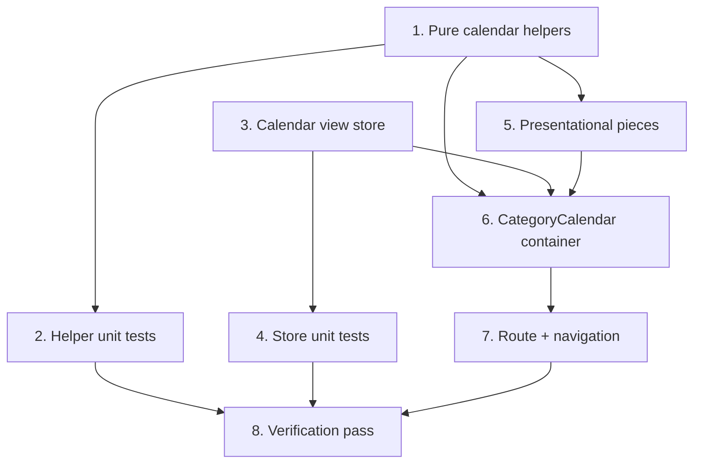

# Implementation Plan

## Overview

No backend or schema changes — the calendar is a read view over the Spec A range
endpoint. Work flows: pure helpers (with exhaustive unit tests) → view store
(with tests) → presentational pieces → the calendar container that wires them →
route + navigation entry points → verification. The pure helpers carry the real
behavior; the React components stay thin.

## Task Dependency Graph



```json
{
  "waves": [
    { "wave": 1, "tasks": ["1", "3"] },
    { "wave": 2, "tasks": ["2", "4", "5"] },
    { "wave": 3, "tasks": ["6"] },
    { "wave": 4, "tasks": ["7"] },
    { "wave": 5, "tasks": ["8"] }
  ]
}
```

## Tasks

### Phase 1 — Pure logic and state

- [x] 1. Create the pure calendar helpers
  - Add `src/lib/calendar.ts` with the `CalendarEvent` type and `CalendarView` type, plus `buildMonthGrid(anchor, weekStartsOn?)`, `rangeFor(view, anchor)`, `eventsOnDay(events, day)`, `groupEventsByDay(events, from)`, and `toCalendarEvents(rows)`. Use local date arithmetic; grid emits whole week-aligned rows covering the anchor month; day membership uses interval intersection `[startAt, endAt ?? startAt]`; agenda window is `[startOfToday, +30d)`.
  - _Requirements: 2.1, 2.2, 2.4, 3.1, 4.4, 5.1, 6.1_

- [x] 3. Create the calendar view store
  - Add `src/stores/calendar-store.ts` (Zustand): `view`, `anchorDate`, `setView`, `goToPrevMonth`, `goToNextMonth`, `goToToday`. View/anchor only — no event data.
  - _Requirements: 4.1, 4.2, 4.3_

### Phase 2 — Coverage and presentational pieces

- [x] 2. Unit-test the calendar helpers
  - Vitest tests in `src/lib/calendar.test.ts`: `buildMonthGrid` (rows divisible by 7, week-start alignment, month coverage across a 28/30/31-day month and a month whose 1st is the week-start); `rangeFor` (month vs agenda windows, `from < to`); `eventsOnDay` (single-day hit/miss, multi-day spanning, all-day, local-day boundaries); `groupEventsByDay` (ordering, grouping by local day, `from` filter); `toCalendarEvents` (ISO parsing, null `endAt`).
  - _Requirements: 2.1, 2.2, 2.4, 3.1, 4.4_

- [x] 4. Unit-test the calendar view store
  - Vitest tests in `src/stores/calendar-store.test.ts`: `setView`; `goToPrevMonth`/`goToNextMonth` shift the anchor by exactly one month including year rollover (Dec→Jan, Jan→Dec); `goToToday` resets to the current month. Reset the singleton store in `beforeEach`.
  - _Requirements: 4.1, 4.3_

- [ ] 5. Build the presentational calendar pieces
  - Add `src/components/calendar/calendar-toolbar.tsx` (month/year title, prev/today/next, month|agenda toggle — calls store actions), `month-grid.tsx` (weekday header + `Date[][]`; current-day highlight, out-of-month dimming, up to `MAX_PER_DAY` event chips via `eventsOnDay` with "+N more" overflow; chip shows local start time or "All day" + title), and `agenda-list.tsx` (day-grouped list from `groupEventsByDay`; time range or "All day" + title; neutral empty message). Local timezone formatting; read-only (no edit/drag).
  - _Requirements: 2.2, 2.3, 2.5, 3.2, 3.3, 4.1, 4.2, 6.1, 6.2, 6.3, 7.2_

### Phase 3 — Container, route, navigation

- [ ] 6. Build the CategoryCalendar container
  - Add `src/components/calendar/category-calendar.tsx` (client): read `view`/`anchorDate` + actions from `useCalendarStore`; compute `rangeFor(view, anchorDate)`; fetch `/api/categories/[id]/calendar?from=&to=` on range change (`sonner` on failure, loading indicator); map rows via `toCalendarEvents`; render `<CalendarToolbar>` and, by view, `<MonthGrid>` or `<AgendaList>`.
  - _Requirements: 1.1, 4.4, 5.1, 5.2, 5.3, 5.4, 7.1_

- [ ] 7. Add the route and navigation entry points
  - Add `src/app/(app)/categories/[id]/calendar/page.tsx` (RSC): resolve via `getCategoryForCurrentUser(id)`, `notFound()` on `NotFoundError`, render `<CategoryCalendar categoryId categoryName />`. Add a per-category "Calendar" link in the sidebar category group (`/categories/[id]/calendar`) and a "Calendar" link on each dashboard `CategoryCard`.
  - _Requirements: 1.1, 1.2, 1.3, 1.4_

### Phase 4 — Verification

- [ ] 8. Full verification pass
  - `pnpm build`, `pnpm test`, `pnpm lint`, `pnpm exec tsc --noEmit` all green (clear `.next` if a stale route type error appears). Manual smoke test: open a category calendar; events land on the correct local days/times; prev/next/today and month/agenda toggle work; a non-owned category 404s; empty and loading states render.
  - _Requirements: 1.1, 1.3, 2.1, 2.2, 3.1, 4.1, 5.1, 6.1, 7.1_

## Notes

- **No backend/schema changes**: reuses the Spec A `GET /api/categories/[id]/calendar` endpoint.
- **Testability**: `src/lib/calendar.ts` is pure and carries the real coverage;
  components are thin renderers (no React component test framework yet).
- **Local time**: all day/grid math is local; the API returns UTC ISO strings,
  parsed to `Date` in `toCalendarEvents` and formatted local at render.
- **Zustand scope**: the calendar store holds only view state (view + anchor);
  event data is fetched per visible range, not stored.
- **Workflow**: committed directly to `main` (no feature branch / PR) per the
  current request. Conventional commits, no AI attribution; keep the suite green
  at each commit.
- **Numbering** follows the dependency waves, not source order (tasks 2/4/5 run
  after 1/3).
