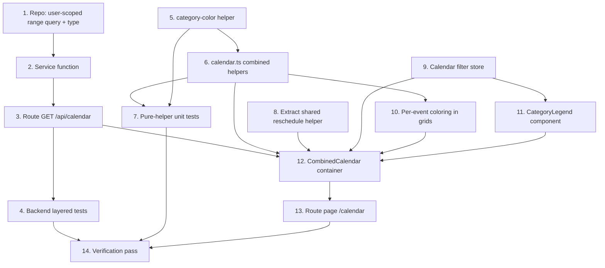

# Implementation Plan

## Overview

Add a combined multi-category calendar at `/(app)/calendar`. Work splits into
three independent tracks that converge on the container: a **backend** track (a
user-scoped range query joined to the category, its service, route, and tests);
a **pure-logic** track (color resolution + combined-event mapping + visibility
filter, all unit-tested); and a **UI plumbing** track (extract the shared
reschedule helper, add the filter store, color the event chips, build the
legend). The `CombinedCalendar` container wires them together, then the route
page mounts it. No schema changes — `Category.color` already exists and the
no-overlap rule is already cross-category.

## Task Dependency Graph



```json
{
  "waves": [
    { "wave": 1, "tasks": ["1", "5", "8", "9"] },
    { "wave": 2, "tasks": ["2", "6"] },
    { "wave": 3, "tasks": ["3", "7", "10", "11"] },
    { "wave": 4, "tasks": ["4", "12"] },
    { "wave": 5, "tasks": ["13"] },
    { "wave": 6, "tasks": ["14"] }
  ]
}
```

## Tasks

### Phase 1 — Backend and pure foundations

- [x] 1. Add the user-scoped range query to the repository
  - In `src/repositories/planning-item.repository.ts`, add `listScheduledItemsForUser(userId, from, to): Promise<ScheduledItemWithCategory[]>`. Reuse the same overlap predicate as `listScheduledItemsByCategory` (`startAt: { not: null, lt: to }`, `OR: [{ endAt: null, startAt: { gte: from } }, { endAt: { gte: from } }]`, `deletedAt: null`, live list + `category: { userId, deletedAt: null }`), scoped to the whole user. Use `include: { list: { select: { category: { select: { id: true, name: true, color: true } } } } }`, then flatten each row to `ScheduledItemWithCategory` (spread the `PlanningItem` fields + `categoryId`/`categoryName`/`categoryColor`) so no Prisma relation shape leaks. Order `startAt asc, createdAt asc`. Import the `ScheduledItemWithCategory` type from `src/lib/calendar.ts` (type-only).
  - _Requirements: 4.1, 4.2, 4.4_

- [x] 5. Add the category-color helper
  - Create `src/lib/category-color.ts` with `CATEGORY_COLOR_PALETTE` (a fixed array of accessible hex colors) and `resolveCategoryColor(color: string | null, categoryId: string): string`. Return `color` when it is a non-empty string; otherwise derive a stable index from a small deterministic hash of `categoryId` modulo the palette length. Pure and deterministic — no randomness.
  - _Requirements: 2.1, 2.2_

- [x] 8. Extract the shared reschedule helper
  - Create `src/lib/calendar-reschedule.ts` exporting `errorMessage(res, fallback)` and a `rescheduleEvent`-style helper that performs the optimistic update + `PATCH /api/planning-items/[id]` + revert-with-toast flow over a `setEvents` setter (or a small hook `useEventReschedule`). Refactor `src/components/calendar/category-calendar.tsx` to consume it, removing its local `errorMessage`/`handleReschedule` duplication. Behavior must stay identical to D2 (optimistic move, PATCH `{ startAt, endAt }`, revert + `toast.error` on `!res.ok`).
  - _Requirements: 5.1_

- [x] 9. Add the calendar filter store
  - Create `src/stores/calendar-filter-store.ts` (`useCalendarFilterStore`) holding `hiddenCategoryIds: Set<string>` with `toggle(categoryId)` (returns a NEW Set for reactivity), `isHidden(categoryId)`, and `reset()`. Default is an empty set (all categories visible), so newly created categories appear automatically. In-memory (session-scoped).
  - _Requirements: 3.2, 3.3, 3.4, 3.6_

### Phase 2 — Service and combined event helpers

- [x] 2. Add the service function
  - In `src/services/planning-item.service.ts`, add `listScheduledItemsForCurrentUserRange(from, to): Promise<ScheduledItemWithCategory[]>` that resolves the acting user via `getCurrentUserId()` (authoritative ownership) and delegates to `listScheduledItemsForUser`. No category-ownership precheck needed — the query is already user-scoped.
  - _Requirements: 4.1, 4.4, 4.5_

- [x] 6. Add combined-event helpers to `src/lib/calendar.ts`
  - Extend `CalendarEvent` with optional `categoryId?: string`, `categoryName?: string`, `color?: string`. Add the `ScheduledItemWithCategory` interface (`PlanningItem` + `categoryId` + `categoryName` + `categoryColor: string | null`). Add `toCombinedCalendarEvents(rows): CalendarEvent[]` (reuse the existing parse/skip-no-`startAt` rules, and attach `categoryId`, `categoryName`, and `color = resolveCategoryColor(row.categoryColor, row.categoryId)`). Add `filterVisibleEvents(events, hiddenIds: ReadonlySet<string>): CalendarEvent[]` returning events whose `categoryId` is not in `hiddenIds` (empty set → all).
  - _Requirements: 2.3, 3.2, 3.3, 3.5, 4.2_

### Phase 3 — Route, tests, and presentational pieces

- [x] 3. Add the combined range route
  - Create `src/app/api/calendar/route.ts` mirroring the per-category calendar route: the same `rangeSchema` (`from`/`to` coerced dates, `to > from`) and `mapErrorToResponse` contract (ZodError → 400, ValidationError → 400, UnauthorizedError → 401, NotFoundError → 404, else 500). `GET` parses the range from the query string, calls `listScheduledItemsForCurrentUserRange`, returns the array with 200. Thin — no Prisma, no business logic.
  - _Requirements: 4.1, 4.3, 4.5_

- [x] 7. Unit-test the pure helpers
  - Add `src/lib/category-color.test.ts`: `resolveCategoryColor` returns the set color; derives a palette color for a null/empty color; the same id maps to the same color; different ids spread across the palette. Extend `src/lib/calendar.test.ts`: `toCombinedCalendarEvents` (attaches categoryId/name/color, drops rows with no `startAt`, parses dates); `filterVisibleEvents` (empty hidden → all, one hidden id removes only that category, all hidden → none).
  - _Requirements: 2.1, 2.2, 2.3, 3.2, 3.3, 3.5_

- [x] 10. Color the event chips in the grids
  - In `src/components/calendar/month-grid.tsx`, `time-grid.tsx`, and `agenda-list.tsx`, when an event carries `color`, render it with that color as an ACCENT (colored left border + light tint / dot) while keeping the existing text foreground so titles stay readable at any hue. When `color` is absent (per-category calendar), rendering is unchanged. Apply the color via inline style from `event.color`.
  - _Requirements: 2.1, 2.3, 2.4_

- [x] 11. Build the CategoryLegend component
  - Create `src/components/calendar/category-legend.tsx`: reads categories from `useWorkspaceStore` and hidden state from `useCalendarFilterStore`; renders each category as a color swatch (via `resolveCategoryColor(category.color, category.id)`) + name + on/off toggle button; clicking a toggle calls `useCalendarFilterStore.toggle(id)`. Accessible (button with `aria-pressed`).
  - _Requirements: 3.1, 3.2, 3.3, 3.6_

### Phase 4 — Container and backend tests

- [x] 4. Add backend layered tests for the combined range
  - Create `src/app/api/calendar/route.test.ts` and extend the repository/service tests: repository `listScheduledItemsForUser` (user scope across categories, range overlap incl. multi-day boundary, category join returns id/name/color, excludes deleted and other users) using the stable seeded categories with idempotent cleanup; service `listScheduledItemsForCurrentUserRange` (delegates with the resolved user); route `GET /api/calendar` (200 with data, 400 on missing/invalid range, 401 unauthenticated).
  - _Requirements: 4.1, 4.2, 4.3, 4.4, 4.5_

- [x] 12. Build the CombinedCalendar container
  - Create `src/components/calendar/combined-calendar.tsx`, mirroring `CategoryCalendar` but: call `ensureLoaded()` and read `categories` from `useWorkspaceStore`; read `hiddenCategoryIds` from `useCalendarFilterStore`; fetch `GET /api/calendar?from=&to=` for `rangeFor(view, anchor)`; map with `toCombinedCalendarEvents`; apply `filterVisibleEvents` before rendering. Render `<CalendarToolbar/>` + `<CategoryLegend/>`, then month → `<MonthGrid/>`, week/day → `<TimeGrid onReschedule=…/>`, agenda → `<AgendaList/>`, plus the `<DetailSheet/>` peek. Use the shared reschedule helper from task 8. Empty state when there are no visible events (never an error).
  - _Requirements: 1.1, 1.2, 1.3, 1.4, 3.5, 5.1, 5.2_

### Phase 5 — Route page

- [x] 13. Add the /calendar route page
  - Create `src/app/(app)/calendar/page.tsx` as a server component (inherits the `(app)` sidebar shell + `auth()` guard) that renders `<CombinedCalendar/>`, filling the available screen space consistent with the per-category calendar. Leave the per-category calendar route untouched.
  - _Requirements: 1.1, 1.5, 4.5_

### Phase 6 — Verification

- [x] 14. Full verification pass
  - `pnpm exec tsc --noEmit`, `pnpm lint`, `pnpm test`, `pnpm build` all green (clear `.next` if a stale route type error appears). Manual smoke test: `/calendar` shows events from multiple categories in distinct colors; an uncolored category gets a stable color that survives reload; toggling a category hides/shows its events instantly and the state survives view/period navigation; all-off shows an empty state; drag reschedules a timed event and an overlapping drop reverts with the conflict toast; the per-category calendar still works unchanged.
  - _Requirements: 1.1, 1.4, 2.1, 2.2, 2.4, 3.2, 3.4, 3.5, 4.3, 5.2_

## Notes

- **No backend/schema changes beyond a new read path**: reuses `Category.color`,
  the `PATCH /api/planning-items/[id]` reschedule, and the already-cross-category
  no-overlap rule.
- **Additive**: the per-category calendar (`/categories/[id]/calendar`) and its
  endpoint stay unchanged; the combined view is a parallel container over the
  same presentational grids.
- **Testability**: `resolveCategoryColor`, `toCombinedCalendarEvents`, and
  `filterVisibleEvents` are pure and unit-tested; the container is a thin
  interaction layer. Backend gets layered tests (repo/service/route).
- **Shared reschedule helper**: task 8 extracts the D2 reschedule glue so both
  the per-category and combined containers share one implementation.
- **Coloring**: category color is applied as an accent (border/tint) to preserve
  text contrast regardless of hue.
- **Workflow**: committed directly to `main` (no branch/PR) per the current
  request. Conventional commits, no AI attribution; keep the suite green.
- **Numbering** follows the dependency waves (parallelizable within a wave).
