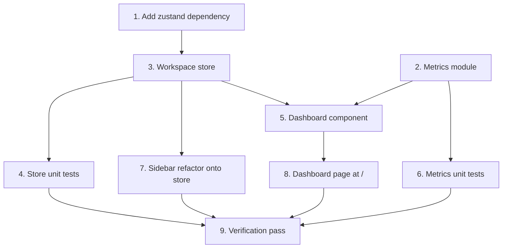

# Implementation Plan

## Overview

The dashboard is a read model — no backend or schema changes. Work flows:
dependency (Zustand) → pure metrics module (with exhaustive unit tests) →
workspace store (with tests) → sidebar refactor onto the store → dashboard UI →
verification. The metrics module is built and tested first because it holds all
the behavior; the UI is a thin renderer over it. Each phase keeps the app
building and green.

## Task Dependency Graph



```json
{
  "waves": [
    { "wave": 1, "tasks": ["1", "2"] },
    { "wave": 2, "tasks": ["3", "6"] },
    { "wave": 3, "tasks": ["4", "5", "7"] },
    { "wave": 4, "tasks": ["8"] },
    { "wave": 5, "tasks": ["9"] }
  ]
}
```

## Tasks

### Phase 1 — Foundations

- [ ] 1. Add the Zustand dependency
  - Add `zustand` (latest 5.x) to `package.json` dependencies and install with pnpm. Confirm the lockfile updates and `pnpm build` still runs.
  - _Requirements: 6.1_

- [ ] 2. Create the pure dashboard metrics module
  - Add `src/lib/dashboard-metrics.ts` exporting `computeDashboard(tasks, categories, lists, statuses, now)` and its `DashboardSummary` / `CategoryStats` / `DashboardData` types. Encode: open = status not `completado`/`cancelado`; completed = `completado`; overdue = open AND `dueAt` < now; due today = open AND (`dueAt`|`startAt`) in the local day; upcoming = open AND (`dueAt`|`startAt`) in `[startOfTomorrow, +7d)`; count only tasks whose `listId` is in `lists`; group by `list.categoryId`; summary totals = sum of per-category. Use local day boundaries derived from `now`.
  - _Requirements: 2.1, 2.2, 2.3, 2.4, 3.2, 3.3, 4.1, 4.2, 4.3, 6.2_

### Phase 2 — State and coverage

- [ ] 3. Create the workspace store
  - Add `src/stores/workspace-store.ts` (Zustand): `categories`, `lists`, `status`, `ensureLoaded()` (fetch `/api/categories` + `/api/lists` once, guarded), `reload()`, and mutators `addCategory`/`updateCategory`/`removeCategory` (also drops the category's lists) and `addList`/`updateList`/`removeList`.
  - _Requirements: 6.1, 6.2_

- [ ] 4. Unit-test the workspace store
  - Vitest tests: `removeCategory` also removes its lists; add/update/remove list; `ensureLoaded` guards against duplicate fetches and populates state (mock `fetch`); `reload` refetches.
  - _Requirements: 6.1, 6.2_

- [ ] 6. Unit-test the metrics module
  - Exhaustive Vitest tests for `computeDashboard`: open/completed partition; overdue/due-today/upcoming bucketing across local-day boundaries; tasks in deleted (absent) lists excluded; per-category grouping via `list.categoryId`; summary totals equal the sum of categories; empty inputs return zeroed metrics.
  - _Requirements: 2.5, 3.2, 3.3, 4.1, 4.2, 4.3, 6.2_

### Phase 3 — UI

- [ ] 5. Build the dashboard component and cards
  - Add `src/components/dashboard/dashboard.tsx` (client): `ensureLoaded()` + read store categories/lists; fetch `/api/planning-items` and `/api/statuses` (task snapshot, `sonner` on failure); `useMemo(computeDashboard(...))`; render loading skeletons, the onboarding empty state (no categories), the summary strip, and a card per category. Add presentational `src/components/dashboard/summary-strip.tsx` and `category-card.tsx` (open/completed/overdue/upcoming, open-by-status breakdown, links to `/lists/[listId]`, neutral empty card).
  - _Requirements: 1.1, 1.2, 1.3, 2.1, 2.2, 2.3, 2.4, 2.5, 3.1, 3.2, 3.3, 3.4, 3.5, 5.1, 5.2_

- [ ] 7. Refactor the sidebar onto the workspace store
  - In `src/components/layout/app-sidebar.tsx`, replace the local `useState` + fetch of categories/lists with the store (`ensureLoaded()` on mount; read from the store). Keep the create/rename/delete handlers' API calls + toasts, but update the store via its mutators instead of local `setState`. Preserve active-list highlighting and the controlled collapsible.
  - _Requirements: 6.1, 6.2_

- [ ] 8. Render the dashboard at the home route
  - Update `src/app/(app)/page.tsx` to render `<Dashboard />` in place of the empty state.
  - _Requirements: 1.1_

### Phase 4 — Verification

- [ ] 9. Full verification pass
  - `pnpm build`, `pnpm test`, `pnpm lint`, `pnpm exec tsc --noEmit` all green (clear `.next` if a stale-cache route type error appears). Manual smoke test: dashboard shows correct numbers; creating/deleting a list in the sidebar updates the cards without a reload; onboarding state with no categories; a deleted list's tasks drop out of the counts.
  - _Requirements: 1.1, 2.1, 3.1, 4.3, 5.1, 6.1, 6.2_

## Notes

- **No backend/schema changes**: the dashboard is a read model over existing
  entities; all logic is client-side in the pure metrics module + store.
- **Testability**: the metrics module is pure so it carries the real test
  coverage; the dashboard component is a thin renderer (no React component test
  framework in the project yet).
- **Local time**: metric buckets use browser-local day boundaries derived from
  `now`, consistent with the editor's local↔UTC handling.
- **Workflow**: per the current request, work is committed directly to `main`
  (no feature branch / PR) until the normal branch+PR flow is resumed.
  Conventional commits, no AI attribution; keep the suite green at each commit.
- **Task numbering** follows the dependency waves, not source order (tasks 5/6
  are interleaved with 3/4 by design).
