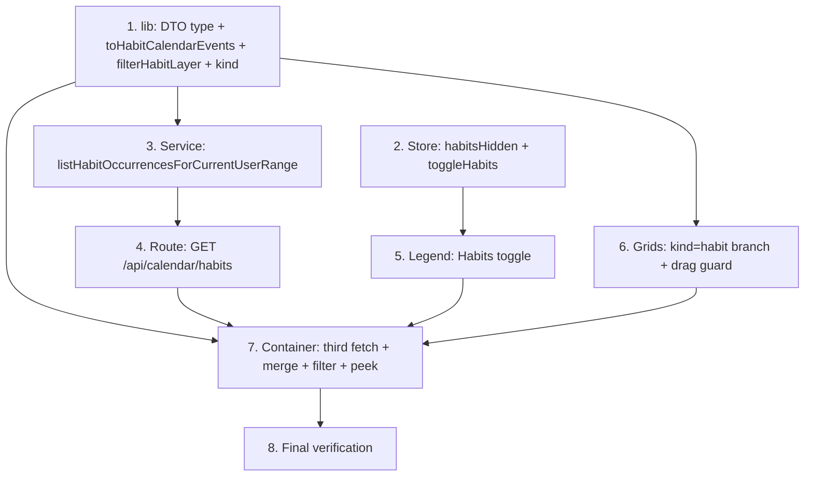

# Implementation Plan

## Overview

Implementation of the `habits-on-calendar` feature: a toggleable habit layer on
the combined calendar, built additively on the reminders-on-calendar pattern.
Bottom-up: pure mappers/filters + DTO type and the store flag first, then the
service expansion, the read endpoint, the legend/grid rendering branches, and
finally the container wiring, closing with full verification. No schema changes;
occurrence expansion reuses `generateOccurrences` and `listHabitsByUser`.

## Task Dependency Graph



```json
{
  "waves": [
    { "wave": 1, "tasks": ["1", "2"] },
    { "wave": 2, "tasks": ["3", "5", "6"] },
    { "wave": 3, "tasks": ["4"] },
    { "wave": 4, "tasks": ["7"] },
    { "wave": 5, "tasks": ["8"] }
  ]
}
```

## Tasks

- [x] 1. Pure DTO type, mappers, and the `CalendarEvent` discriminator
  - Add `HabitOccurrenceDTO` to `src/lib/habits.ts` (habitId, title, description, itemTypeId, date "YYYY-MM-DD", timeMinutes|null, categoryId, categoryName, categoryColor, completed).
  - Extend `CalendarEvent` in `src/lib/calendar.ts`: `kind?: "scheduled" | "reminder" | "habit"` and optional `completed?: boolean`.
  - Add `toHabitCalendarEvents(rows)` (point event at timeMinutes, all-day when null; `endAt` null; `kind = "habit"`; `id = "{habitId}:{date}"`; carries `completed`; category/color via `resolveCategoryColor`; drops unparseable dates) and `filterHabitLayer(events, hidden)` (drops only `kind === "habit"` when hidden).
  - Add property tests in `src/lib/calendar.test.ts` (fast-check) for Property 1 (mapping), Property 2 (habit-layer filter), Property 3 (`filterVisibleEvents` excludes a hidden-category habit).
  - _Requirements: 1.1, 1.3, 1.5, 1.6, 2.2, 2.3, 2.6_

- [x] 2. Habit-layer toggle in the calendar filter store
  - Add `habitsHidden: boolean` (default false) and `toggleHabits()` to `src/stores/calendar-filter-store.ts`, mirroring the reminders toggle; keep it session-scoped.
  - Add store tests: default shown, toggle flips, independent of category and reminder toggles.
  - _Requirements: 2.1, 2.4, 2.5_

- [x] 3. Service: expand habit occurrences for a range
  - Add `listHabitOccurrencesForCurrentUserRange(from, to)` to `src/services/planning-item.service.ts`: resolve the user, call `listHabitsByUser`, and for each habit build `ruleFromItem` + `completedKeysFromRows`, expand `generateOccurrences(rule, from, to)`, and emit one `HabitOccurrenceDTO` per occurrence (`date = dateKey(occurrence)`, `timeMinutes = recurrenceTimeMinutes`, category fields, `completed`).
  - Add service tests (repository mocked): expansion over a window, `completed` from the completion set, empty when the window has no occurrence, and a model-based check against `generateOccurrences` (Property 4).
  - _Requirements: 1.1, 4.1, 4.2, 4.3, 4.6, 4.7_

- [x] 4. Route: `GET /api/calendar/habits`
  - Add `src/app/api/calendar/habits/route.ts`, thin, mirroring `/api/calendar/reminders`: reuse the `rangeSchema` + shared `mapErrorToResponse`; call `listHabitOccurrencesForCurrentUserRange`; 200 with the DTO array.
  - Add route tests: 200 with data, 400 missing/invalid range, 401 unauthenticated, 500 no-leak.
  - _Requirements: 4.1, 4.4, 4.5_

- [x] 5. Legend: Habits toggle
  - Add a "Habits" toggle chip (icon `Repeat`, `aria-pressed={!habitsHidden}`, calls `toggleHabits`) to `src/components/calendar/category-legend.tsx`, after the Reminders toggle, mirroring its styling; always renders.
  - _Requirements: 2.1_

- [x] 6. Grids: render the habit layer + keep it read-only
  - `month-grid.tsx`: in `EventChip`, add a `kind === "habit"` branch (Repeat icon, distinct treatment, completed = check/dimmed).
  - `time-grid.tsx`: render a habit point/all-day marker with a Repeat icon and completed treatment; change the drag guard to `canDrag = draggable && event.kind === "scheduled"` so habits (and reminders) never drag.
  - `agenda-list.tsx`: add a `kind === "habit"` row branch (Repeat icon, completed treatment).
  - _Requirements: 1.2, 1.3, 1.4, 1.6, 3.1, 3.4_

- [x] 7. Container: fetch, merge, filter, and peek the habit layer
  - In `combined-calendar.tsx`, add a third parallel fetch (`/api/calendar/habits?from=&to=`), map with `toHabitCalendarEvents`, and append to the merged events.
  - Read `habitsHidden`; compute visible events as `filterHabitLayer(filterReminderLayer(filterVisibleEvents(events, hiddenCategoryIds), remindersHidden), habitsHidden)`.
  - In the detail peek, show the occurrence completion state for `kind === "habit"`.
  - Keep the non-blocking error toast on any fetch failure (render what loaded).
  - _Requirements: 1.1, 1.7, 2.2, 2.3, 2.6, 3.2, 3.3, 5.1, 5.2, 5.3, 5.4, 5.5_

- [x] 8. Final verification
  - Run `tsc`, lint, the full test suite, and the production build; fix any failures so all gates are green.
  - _Requirements: 1.1, 2.1, 3.1, 4.1, 5.1_

## Notes

- Property numbers reference the "Correctness Properties" section of `design.md`
  (5 properties). Property-based tests use fast-check; the service expansion is
  validated model-based against `generateOccurrences`.
- The repository is the sole Prisma boundary; the feature reuses `listHabitsByUser`
  with NO new query. Everything is scoped to the authenticated `userId`.
- Additive only: one more `CalendarEvent.kind` value + optional `completed`, a new
  read endpoint, a new store flag, and rendering branches. Nothing existing
  changes behavior.
- Out of scope (future): toggling completion from the calendar, editing the rule
  from the calendar, the per-category calendar habit layer, recurring reminders,
  full RRULE.
