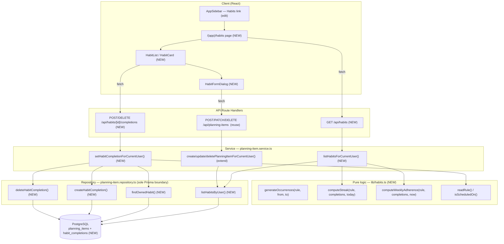

# Design Document

## Overview

Habits are the last and heaviest item type of the roadmap. A habit is a
`habito`-type `PlanningItem` that carries a **structured, simple recurrence rule**
(days-of-week + time-of-day + optional "every N days" interval) in **dedicated
nullable columns**, following the exact zero-coupling pattern objectives use for
`objectiveStartAt`/`objectiveEndAt`/`progress`. Occurrences are **never
materialized** as rows: they are computed on the fly from the rule over a
half-open date window by a pure helper. Per-occurrence completions live in a new
`HabitCompletion` table keyed on `(habit, normalized date)`, and adherence
(a **streak** and a **weekly ratio**) is **computed** from completions versus the
schedule — never stored on `progress`.

This design deliberately reuses the vertical-slice architecture already
established by the tasks/reminders/notes/objectives features:

- **Pure logic** lives in a new `src/lib/habits.ts` (React- and I/O-free, fully
  unit- and property-testable), mirroring `src/lib/{reminders,notes,objectives,calendar}.ts`.
- **The repository is the sole Prisma boundary** (`src/repositories/planning-item.repository.ts`);
  no service or route touches Prisma directly.
- **The service** (`src/services/planning-item.service.ts`) owns business rules:
  validation of the effective rule, ownership prechecks, and orchestrating
  completions.
- **Zod validators** (`src/validators/planning-item.schema.ts`) fast-fail invalid
  request bodies at the transport edge.
- **The Habits view** (`/(app)/habits`) is a thin renderer over a single read
  endpoint plus the existing generic write path.

The recurrence rule does **not** place the habit on the calendar and does **not**
participate in the timed no-overlap rule in this phase (Requirement 1.8). Full
RRULE, habits-on-calendar, and recurring reminders are explicitly **out of scope**
(future phases).

### Scope mapping to requirements

| Concern | Requirements | Where |
| --- | --- | --- |
| Recurrence columns + rule shape | 1 | Prisma schema, migration |
| Rule validation | 2, 9.6 | zod schema + service |
| Occurrence generation | 3 | `src/lib/habits.ts` |
| Mark / unmark occurrence | 4 | service + repository + `HabitCompletion` |
| Streak | 5, 8.4 | `src/lib/habits.ts` |
| Weekly adherence | 6, 8.5 | `src/lib/habits.ts` |
| Habits view | 7, 9 | `/(app)/habits`, `components/habits/*`, sidebar |
| Read endpoint | 8 | `GET /api/habits` |
| Create/edit/archive (reuse write path) | 9 | existing `/api/planning-items` |

## Architecture

The habit feature threads through the existing layered slice. New pieces are
marked **NEW**; everything else is reused.



### Key architectural decisions

**1. Habit row = `PlanningItem` + dedicated nullable columns (zero-coupling).**
Exactly like objectives. No polymorphism, no separate `habits` table for the rule.
The columns are nullable so every other item type is untouched, and the migration
is additive-only. This keeps the existing generic write path (`/api/planning-items`)
usable for create/edit/archive without a bespoke habit write endpoint
(Requirement 9.3).

**2. Occurrences are computed, never stored.** A habit is a rule, not a set of
rows. `generateOccurrences` is a pure function of `(rule, from, to)` returning
ordered normalized dates. This is the crux of Requirement 3 and enables cheap
property testing.

**3. Completions are a separate table, keyed on `(habit, date)`.** A completion
is a fact ("this occurrence was done"), not a mutation of the habit. A dedicated
table with a unique `(planningItemId, date)` index gives idempotency at the
database level (Requirement 4.2, 4.7) and cascade-deletes with the habit
(Requirement 9.5, consistency with soft-delete/archive at the read layer).

**4. Streak and weekly adherence are computed, never persisted.** They are pure
functions of the schedule + completion date set + "now". `progress` is never read
or written for habits (Requirements 5.7, 6.6).

### Decision: weekday representation — `Int[]` of ISO weekday numbers

**Chosen:** `recurrenceDays Int[]` storing ISO-8601 weekday numbers (`1` = Monday
… `7` = Sunday), Postgres `integer[]`.

| Option | Pros | Cons |
| --- | --- | --- |
| **`Int[]` (ISO 1..7)** ✅ | Human-readable in DB; trivial zod validation (`array(int().min(1).max(7))`); Prisma has first-class scalar-list support for Postgres; matches ISO/`Date` conventions the codebase already reasons about; easy to add/remove a day | Slightly larger storage than a bitmask (irrelevant at this scale); array must be normalized (dedup + sort) in the service |
| Bitmask `Int` (1<<0..1<<6) | Compact; set operations are bit ops | Opaque in the DB; needs encode/decode everywhere; off-by-one bugs; harder to validate/read; premature optimization for ≤7 flags |

The `Int[]` wins on readability and validation ergonomics; the storage delta is
negligible for a set that can never exceed 7 elements. The service **normalizes**
the array to a distinct, ascending set before persisting so the stored value is
canonical.

**ISO weekday numbering rationale.** JavaScript's `Date.getDay()` returns `0` =
Sunday … `6` = Saturday. Storing ISO `1..7` (Mon..Sun) matches the requirements'
"Monday through Sunday" wording (Requirement 1.2) and the "current week starts
Monday" rule (Requirement 6.2). `src/lib/habits.ts` provides a single
`isoWeekday(date)` helper (`const d = date.getDay(); return d === 0 ? 7 : d;`) so
the `getDay()`→ISO conversion lives in exactly one place.

### Decision: time-of-day representation — minutes-since-midnight `Int` (0..1439)

**Chosen:** `recurrenceTimeMinutes Int?` storing minutes since local midnight
(`hours * 60 + minutes`, range `0..1439`).

| Option | Pros | Cons |
| --- | --- | --- |
| **`Int` minutes 0..1439** ✅ | No timezone semantics (a wall-clock time-of-day is not an instant); trivial validation and arithmetic; no Prisma `@db.Time` mapping quirks; deterministic across environments | Must split/join to `HH:mm` at the UI edge (one small helper each way) |
| Postgres `time` / `@db.Time` | "Native" time type | Prisma maps `time` to a full `DateTime` with an arbitrary date part → tz/DST foot-guns; the requirement is a pure hours+minutes with **no** date/tz meaning |
| Two columns (`hours`, `minutes`) | Explicit | Two nullable columns to keep consistent; more validation surface; no upside over a single derived int |

A recurrence time-of-day is a **wall-clock** value ("08:00 on each scheduled
day"), not a timestamp. Encoding it as minutes-since-midnight sidesteps every
timezone/DST pitfall a `time`/`timestamp` column would introduce, and matches the
codebase's existing `MINUTES_PER_DAY` convention in `calendar.ts`. `habits.ts`
exposes `minutesToHm(min)` and `hmToMinutes(h, m)` for the UI/validation edges.

The time-of-day is the anchor time each occurrence is placed at; because habits
are off-calendar this phase, it is stored and echoed but does not affect
occurrence **dates**.

### Decision: interval anchor — `recurrenceAnchor Date?`, default normalized `createdAt`

`recurrenceInterval Int?` (1..365) counts every N days from an **anchor date**
(Requirement 1.4). The anchor is stored in its own nullable `recurrenceAnchor`
(Postgres `date`) column. When absent, the effective anchor is the habit's
`createdAt` normalized to a local date (Requirement 1.4 / glossary "anchor date =
creation date when no explicit start is given"). Resolving the effective anchor
is done in `habits.ts` (`resolveAnchor(rule, createdAt)`) so both the generator
and the service agree on one definition.

### Decision: completion toggle endpoint — `POST` / `DELETE /api/habits/[id]/completions`

**Chosen:** a nested completions collection under the habit resource.

- `POST /api/habits/[id]/completions` with body `{ date: "YYYY-MM-DD" }` marks the
  occurrence complete (idempotent create).
- `DELETE /api/habits/[id]/completions` with body `{ date: "YYYY-MM-DD" }` marks it
  incomplete (idempotent remove).

| Option | Pros | Cons |
| --- | --- | --- |
| **`POST`/`DELETE …/[id]/completions`** ✅ | RESTful: a completion is a sub-resource of a habit; the verb carries the intent (create vs remove) so the body is just the date; ownership scoping via `[id]` is explicit; mirrors how the reminders slice adds a focused sub-action | Two handlers instead of one |
| Single toggle `POST …/[id]/toggle` `{ date, done }` | One handler | `done:boolean` in the body duplicates what HTTP verbs already express; "toggle" hides whether the result is on/off (not idempotent-by-verb); less RESTful |

`POST`/`DELETE` makes each operation **idempotent by construction** (Requirements
4.2, 4.4): a repeated `POST` is a no-op create, a repeated `DELETE` is a no-op
remove. The habit **row** create/edit/archive still reuses
`POST/PATCH/DELETE /api/planning-items` (Requirement 9.3) — this new endpoint is
**only** for completions.

Multi-tenancy: every query is scoped to `userId` (resolved server-side via
`getCurrentUserId()`), and the habit-ownership precheck runs before any completion
write (Requirement 4.6).

## Components and Interfaces

### `src/lib/habits.ts` (NEW) — pure recurrence logic

React- and I/O-free; `now`/`today` are always injected so results are
deterministic (mirrors `objectives.ts`/`calendar.ts`).

```ts
import type { PlanningItem } from "@prisma/client";

/** ISO weekday: 1 = Monday … 7 = Sunday. */
export type IsoWeekday = 1 | 2 | 3 | 4 | 5 | 6 | 7;

/** The structured recurrence rule, read off a habit's dedicated columns. */
export interface RecurrenceRule {
  /** Distinct ISO weekdays (1..7); empty when the rule is interval-only. */
  days: IsoWeekday[];
  /** "Every N days" from the anchor; null when the rule is weekday-only. */
  interval: number | null;
  /** Local date the interval counts from (already normalized). */
  anchor: Date;
  /** Minutes since local midnight (0..1439); null when unset. */
  timeMinutes: number | null;
}

/** A habit enriched with its owning category + computed adherence (view model). */
export interface HabitWithAdherence extends PlanningItem {
  categoryId: string;
  categoryName: string;
  categoryColor: string | null;
  rule: RecurrenceRule;
  streak: number;
  weekly: WeeklyAdherence;
  /** Whether today is a scheduled occurrence (drives the mark-today control). */
  scheduledToday: boolean;
  /** Whether today's occurrence has a completion. */
  completedToday: boolean;
}

export interface WeeklyAdherence {
  completed: number; // numerator
  total: number;     // denominator
}

/** JS getDay() (0=Sun..6=Sat) → ISO (1=Mon..7=Sun). Single conversion point. */
export function isoWeekday(date: Date): IsoWeekday;

/** Local midnight at the start of `date`'s day. */
export function normalizeDate(date: Date): Date;

/** minutes → { hours, minutes }; and back. UI/validation edges only. */
export function minutesToHm(min: number): { hours: number; minutes: number };
export function hmToMinutes(hours: number, minutes: number): number;

/** Effective anchor: explicit rule.anchor, else normalized createdAt. */
export function resolveAnchor(anchor: Date | null, createdAt: Date): Date;

/** True when `date` (normalized) is scheduled by `rule`. */
export function isScheduledOn(rule: RecurrenceRule, date: Date): boolean;

/**
 * Ordered, de-duplicated normalized dates the rule schedules in [from, to).
 * Pure: identical inputs → identical output; never touches the DB.
 * Weekday-only, interval-only, and combined (AND) rules are all supported.
 * Returns [] when from >= to, when the window has no qualifying date, or when
 * an interval < 1 is supplied (defensive; validation already forbids it).
 */
export function generateOccurrences(
  rule: RecurrenceRule,
  from: Date,
  to: Date,
): Date[];

/**
 * Consecutive completed scheduled occurrences ending at the most recent
 * scheduled occurrence dated on/before `today`. 0 when there is no such
 * occurrence or the most recent one is not completed. `completedKeys` is the
 * set of normalized-date keys (see `dateKey`) that have a completion.
 */
export function computeStreak(
  rule: RecurrenceRule,
  completedKeys: ReadonlySet<string>,
  today: Date,
): number;

/**
 * "X of Y" for the current week (Mon 00:00 inclusive → next Mon 00:00
 * exclusive, local). completed ≤ total always; both 0 when the week has no
 * scheduled occurrence.
 */
export function computeWeeklyAdherence(
  rule: RecurrenceRule,
  completedKeys: ReadonlySet<string>,
  now: Date,
): WeeklyAdherence;

/** Canonical string key for a normalized date, e.g. "2026-07-20" (local). */
export function dateKey(date: Date): string;

/** Reads the rule off a habit row; normalizes days (distinct, ascending). */
export function ruleFromItem(item: PlanningItem): RecurrenceRule;
```

**Notes on the algorithms.**

- `generateOccurrences` walks day-by-day from `max(from, anchor-for-interval)` to
  `to` (exclusive). For each candidate date it applies the predicate: weekday ∈
  `days` (when `days` non-empty) **AND** `(date − anchor) mod N == 0` (when
  `interval` set). When only one dimension is present, only that predicate
  applies; when both are present, both must hold (Requirement 3.7). Day stepping
  uses the DST-safe `setDate` idiom already used in `calendar.ts`.
- `computeStreak` generates scheduled occurrences over a bounded lookback window
  ending at `today`, then walks them newest-first counting completions until the
  first gap (Requirement 5.5). A finite lookback window (e.g. anchor→today,
  capped) keeps it O(days) and pure.
- Both streak and weekly reuse `generateOccurrences` so the "what counts as
  scheduled" definition is single-sourced.

### `src/validators/planning-item.schema.ts` (extend)

Add recurrence fields to **both** create and update schemas. The days array is
validated as distinct ISO weekdays; interval as an integer in `1..365`; time as
`0..23` hours / `0..59` minutes (accepted as `recurrenceTimeMinutes` int
`0..1439`, or split H/M — see UI note). A cross-field refine enforces
"**at least one weekday OR an interval**" (Requirements 2.1, 9.6). On update every
recurrence field is nullable-optional (clearable), consistent with the existing
`objectiveStartAt` precedent.

```ts
// Reusable recurrence field group (added to create; nullable-optional on update)
const recurrenceDays = z
  .array(z.number().int().min(1, "weekday must be 1..7").max(7, "weekday must be 1..7"))
  .max(7, "at most 7 weekdays")
  .refine((a) => new Set(a).size === a.length, "weekdays must be distinct");

const recurrenceInterval = z.number().int().min(1).max(365);
const recurrenceTimeMinutes = z.number().int().min(0).max(1439);
const recurrenceAnchor = z.coerce.date();

// create: .refine(atLeastOneWeekdayOrInterval, { path: ["recurrenceDays"] })
// applied ONLY when itemTypeId resolves to `habito` — the service re-checks the
// EFFECTIVE rule for partial PATCH bodies (same pattern as validateSchedule).
```

A new schema validates the completion request body:

```ts
export const habitCompletionSchema = z.object({
  // Date-only "YYYY-MM-DD"; coerced to a local-midnight Date in the service.
  date: z.string().regex(/^\d{4}-\d{2}-\d{2}$/, "date must be YYYY-MM-DD"),
});
export type HabitCompletionInput = z.infer<typeof habitCompletionSchema>;
```

### `src/services/planning-item.service.ts` (extend)

New/extended functions:

- **`validateRecurrenceRule(effectiveRule)`** — private. Throws `ValidationError`
  when: days contains a value outside 1..7 or a duplicate; interval is set but not
  an integer in 1..365; time is out of range; **and** neither a weekday nor an
  interval is present (Requirements 2.1–2.4, 9.6). Invoked from create/update
  against the **effective** rule (stored row merged with the patch), exactly like
  `validateSchedule`/`validateObjectiveTimeframe`, so a partial PATCH is validated
  against the persisted value and an invalid rule leaves the prior rule unchanged
  (Requirements 1.3, 1.5, 1.7).
- **`createPlanningItemForCurrentUser` / `updatePlanningItemForCurrentUser`
  (extend)** — thread the recurrence columns through, calling
  `validateRecurrenceRule` only when the effective item type is `habito`. Habits
  never enter `assertNoTimedOverlap` and never set `startAt` from the rule
  (Requirement 1.8).
- **`listHabitsForCurrentUser(now = new Date()): Promise<HabitWithAdherence[]>`** —
  resolves the user server-side; calls `listHabitsByUser` (which includes the
  habit's `HabitCompletion` rows); for each habit builds the `RecurrenceRule`,
  computes `streak`, `weekly`, `scheduledToday`, `completedToday` via `habits.ts`;
  returns the enriched view models (Requirements 7.1–7.2, 8.1, 8.4, 8.5). Live
  filter (not deleted, not archived, key `habito`) is enforced in the repository.
- **`setHabitCompletionForCurrentUser(id, dateStr, done): Promise<void>`** —
  resolves the user; `findOwnedHabit(userId, id)` → `NotFoundError` when absent or
  foreign (Requirement 4.6); parses `dateStr` to a normalized local date; verifies
  `isScheduledOn(rule, date)` → `ValidationError` when not scheduled (Requirement
  4.5); then `createHabitCompletion` (`done=true`) or `deleteHabitCompletion`
  (`done=false`). Both repository ops are idempotent (Requirements 4.1–4.4). The
  repository translates the unique-constraint race into a no-op so a concurrent
  double-`POST` still leaves exactly one row (Requirement 4.7).

### Repository — `src/repositories/planning-item.repository.ts` (extend, sole Prisma boundary)

- **`listHabitsByUser(userId): Promise<HabitWithCompletions[]>`** — `habito`-key,
  live (`deletedAt: null, archived: false`), joined to `List → Category`, and
  `include`-ing the item's `habitCompletions`. Flattened so no Prisma relation
  shape leaks (same pattern as `listObjectivesByUser`). Read includes completions
  per Requirement 8.9 (the repo is the only place `HabitCompletion` is read).
- **`findOwnedHabit(userId, id): Promise<PlanningItem | null>`** — like
  `findOwnedPlanningItem` but also filters `itemType: { key: "habito" }`; returns
  `null` when absent/foreign/non-habit so the service can throw `NotFoundError`
  without leaking existence (Requirement 4.6).
- **`createHabitCompletion(userId, planningItemId, date): Promise<void>`** —
  inserts `{ userId, planningItemId, date, completedAt: new Date() }`; catches
  Prisma `P2002` (unique `(planningItemId, date)`) and treats it as success so the
  op is idempotent (Requirements 4.1, 4.2, 4.7).
- **`deleteHabitCompletion(planningItemId, date): Promise<void>`** —
  `deleteMany` on `(planningItemId, date)`; deleting zero rows is success
  (idempotent remove, Requirement 4.4).

```ts
export interface HabitWithCompletions extends PlanningItem {
  categoryId: string;
  categoryName: string;
  categoryColor: string | null;
  completions: { date: Date }[];
}
```

### API routes

- **`GET /api/habits` (NEW)** — thin handler mirroring `GET /api/objectives`:
  `listHabitsForCurrentUser()` → `200` with the array; `UnauthorizedError` → `401`
  with no data (Requirement 8.7); anything else → `500` `{ error: "Internal server error" }`
  with no partial data (Requirement 8.8). Read-only.
- **`POST` / `DELETE /api/habits/[id]/completions` (NEW)** — parse+validate body
  with `habitCompletionSchema`; call `setHabitCompletionForCurrentUser(id, date, true|false)`.
  Error mapping: `ValidationError` → `400` (bad body or date not scheduled,
  Requirement 4.5), `UnauthorizedError` → `401`, `NotFoundError` → `404` (habit not
  owned, Requirement 4.6), else `500`. On success `200`/`204` with a small
  confirmation payload (Requirements 4.1, 4.3).
- **`POST/PATCH/DELETE /api/planning-items` (reuse, unchanged surface)** — carry the
  new recurrence fields through the existing body (Requirements 9.2–9.5).

### UI — `src/components/habits/*` (NEW) + `/(app)/habits/page.tsx` (NEW)

- **`page.tsx`** — server component under `(app)` (inherits sidebar shell +
  `auth()` guard), renders `<HabitsView />` in a centered column, mirroring
  `objectives/page.tsx`.
- **`habits-view.tsx`** — client component: fetches `GET /api/habits`; renders
  loading, **error** ("couldn't load", keeps prior list — Requirement 7.8),
  **empty-state** ("no habits yet", no error — Requirement 7.6), and the habit
  list. Owns optimistic create/edit/archive via `/api/planning-items` and the
  mark-today toggle via `/api/habits/[id]/completions`, re-deriving streak/weekly
  locally for instant (<1s) feedback then reconciling with the server (Requirement
  7.5). Mirrors `objectives-view.tsx`.
- **`habit-card.tsx`** — title, section (category) name, streak (whole number),
  weekly adherence "X of Y this week", and the mark-today control. When today is
  not scheduled, shows "Not scheduled today" and renders **no** toggle
  (Requirements 7.2–7.4).
- **`habit-form-dialog.tsx`** — create/edit form: title (1..200), description
  (0..2000), section (list grouped by category), weekday multi-select, time-of-day
  input, optional interval. Reuses the `FormSheet`/`Form` primitives.
  **GOTCHA (repo-wide):** `z.coerce.number()` breaks the react-hook-form resolver
  typing — so the interval and time fields are kept as **string** form fields and
  converted/clamped on submit (exactly as `objective-form-dialog.tsx` keeps
  `progress` as a string and does `Number(...)` on submit). The weekday set is a
  toggle-group of 7 buttons producing `number[]`.
- **`app-sidebar.tsx` (edit)** — add a "Habits" `SidebarMenuButton` (icon `Repeat`,
  matching the seed's `habito` icon) linking to `/habits`, next to Objectives
  (Requirement 7.7).

## Data Models

### `PlanningItem` — new nullable recurrence columns

Additive, nullable, zero-coupling (mirrors the objective columns). No existing
column changes.

```prisma
model PlanningItem {
  // ...existing columns...
  // Recurrence rule (item type `habito`). All nullable; present only on habits.
  recurrenceDays        Int[]     @map("recurrence_days")          // ISO 1..7; [] when interval-only
  recurrenceTimeMinutes Int?      @map("recurrence_time_minutes")  // minutes since local midnight, 0..1439
  recurrenceInterval    Int?      @map("recurrence_interval")      // "every N days", 1..365
  recurrenceAnchor      DateTime? @map("recurrence_anchor") @db.Date // interval anchor; defaults to createdAt's date

  // ...existing relations...
  habitCompletions HabitCompletion[]

  @@index([userId, itemTypeId])   // NEW: powers the habits list query
  // ...existing indexes...
}
```

> `recurrenceDays` is a Postgres scalar list (`integer[]`). Prisma scalar lists
> are non-nullable at the type level; an empty array `{}` is the "no weekday
> selection" value (the rule is then interval-only). All other recurrence columns
> are nullable and NULL on non-habit rows.

### `HabitCompletion` (NEW table)

```prisma
model HabitCompletion {
  id             String   @id @default(cuid())
  userId         String
  planningItemId String   @map("planning_item_id")
  /// Normalized occurrence date (date-only, no time component).
  date           DateTime @db.Date
  completedAt    DateTime @default(now()) @map("completed_at")

  user         User         @relation(fields: [userId], references: [id], onDelete: Cascade)
  planningItem PlanningItem @relation(fields: [planningItemId], references: [id], onDelete: Cascade)

  @@unique([planningItemId, date])   // one completion per (habit, date) — idempotency
  @@index([userId])
  @@index([planningItemId, date])
  @@map("habit_completions")
}
```

### `User` (relation addition)

```prisma
model User {
  // ...existing...
  habitCompletions HabitCompletion[]
}
```

### Migration note (hand-written)

A single additive migration (e.g. `add_habit_recurrence`) mirroring the style of
`20260722022458_add_objective_fields`:

```sql
-- AlterTable: additive, all nullable (recurrence_days is a non-null Postgres array,
-- defaulting to an empty array so existing rows are unaffected).
ALTER TABLE "planning_items"
  ADD COLUMN "recurrence_days" INTEGER[] NOT NULL DEFAULT ARRAY[]::INTEGER[],
  ADD COLUMN "recurrence_time_minutes" INTEGER,
  ADD COLUMN "recurrence_interval" INTEGER,
  ADD COLUMN "recurrence_anchor" DATE;

-- CreateIndex: powers listHabitsByUser (userId + itemTypeId).
CREATE INDEX "planning_items_userId_itemTypeId_idx"
  ON "planning_items"("userId", "itemTypeId");

-- CreateTable: habit_completions
CREATE TABLE "habit_completions" (
  "id" TEXT NOT NULL,
  "userId" TEXT NOT NULL,
  "planning_item_id" TEXT NOT NULL,
  "date" DATE NOT NULL,
  "completed_at" TIMESTAMP(3) NOT NULL DEFAULT CURRENT_TIMESTAMP,
  CONSTRAINT "habit_completions_pkey" PRIMARY KEY ("id")
);

-- Unique + indexes
CREATE UNIQUE INDEX "habit_completions_planning_item_id_date_key"
  ON "habit_completions"("planning_item_id", "date");
CREATE INDEX "habit_completions_userId_idx" ON "habit_completions"("userId");
CREATE INDEX "habit_completions_planning_item_id_date_idx"
  ON "habit_completions"("planning_item_id", "date");

-- FKs: cascade from both User and PlanningItem
ALTER TABLE "habit_completions"
  ADD CONSTRAINT "habit_completions_userId_fkey"
  FOREIGN KEY ("userId") REFERENCES "users"("id") ON DELETE CASCADE ON UPDATE CASCADE;
ALTER TABLE "habit_completions"
  ADD CONSTRAINT "habit_completions_planning_item_id_fkey"
  FOREIGN KEY ("planning_item_id") REFERENCES "planning_items"("id") ON DELETE CASCADE ON UPDATE CASCADE;
```

The recurrence columns are nullable (except the array, which defaults to empty),
so the migration is safe on the populated table; no backfill is required.

## Correctness Properties

*A property is a characteristic or behavior that should hold true across all
valid executions of a system — essentially, a formal statement about what the
system should do. Properties serve as the bridge between human-readable
specifications and machine-verifiable correctness guarantees.*

These properties are derived from the prework classification of every acceptance
criterion, with redundant criteria consolidated (e.g. the interval/weekday/time
rejection classes appear once each; the occurrence-generation shape and semantics
are consolidated; streak and weekly are single-sourced across Requirements 5/6 and
8.4/8.5). Each property is universally quantified and implemented by a **single**
property-based test (fast-check), min 100 runs.

### Property 1: Weekday normalization yields a distinct, sorted subset of 1..7

*For any* array of integers in `1..7` (with arbitrary duplicates and ordering),
normalizing it for persistence produces a strictly ascending array with no
duplicates whose element set equals the input's element set and is a subset of
`{1..7}`.

**Validates: Requirements 1.2**

### Property 2: A valid recurrence rule is accepted and round-trips through persistence

*For any* recurrence rule that has at least one weekday OR an interval in
`1..365`, together with a valid time-of-day, rule validation accepts it and the
persisted habit reads back the same normalized rule fields (days, interval,
time-of-day, anchor).

**Validates: Requirements 2.5, 9.2**

### Property 3: A rule with no weekday and no interval is rejected

*For any* submission whose weekday set is empty and whose interval is absent,
validation rejects it with an error requiring at least one weekday or an interval,
and no habit is persisted.

**Validates: Requirements 2.1**

### Property 4: Invalid weekday sets are rejected and leave the prior rule unchanged

*For any* weekday set containing a value outside `1..7`, a duplicate value, or more
than 7 entries, validation rejects the rule, returns an error indicating the
weekday value is invalid, and any previously persisted rule is retained unchanged.

**Validates: Requirements 1.3, 2.4**

### Property 5: Out-of-range intervals are rejected and leave the prior rule unchanged

*For any* interval value that is not an integer or falls outside `1..365`,
validation rejects the rule, returns an error indicating the interval range, and
any previously persisted rule is retained unchanged.

**Validates: Requirements 1.5, 2.2**

### Property 6: Invalid times-of-day are rejected and leave the prior rule unchanged

*For any* time-of-day whose hours fall outside `0..23` or whose minutes fall
outside `0..59`, validation rejects the rule, returns an error indicating the
time-of-day is invalid, and any previously persisted rule is retained unchanged.

**Validates: Requirements 1.7, 2.3**

### Property 7: Title and description length bounds are enforced

*For any* create/edit submission whose title has length `0` or greater than `200`,
or whose description length exceeds `2000`, the system rejects the request,
indicates the invalid field, and makes no change to stored state.

**Validates: Requirements 9.6**

### Property 8: Time-of-day encoding round-trips

*For any* hours in `0..23` and minutes in `0..59`, encoding to minutes-since-midnight
and decoding back yields the original hours and minutes, and the encoded value lies
in `0..1439`.

**Validates: Requirements 1.6**

### Property 9: Occurrence generation output is normalized, in-window, ordered, deduplicated, and pure

*For any* recurrence rule and any date window, every generated occurrence is a
date-only value with no time component, lies in the half-open interval
`[from, to)` (never equal to `to`), the sequence is strictly ascending with no
duplicates, the result is empty when `from >= to` or when no date qualifies (or
when the interval is less than 1), and generating twice from identical inputs
yields deep-equal output.

**Validates: Requirements 3.1, 3.4, 3.5, 3.6, 3.8**

### Property 10: Occurrence generation includes exactly the dates satisfying the rule predicate

*For any* recurrence rule and window, the generated set equals exactly the
in-window date-only values that satisfy the rule: for a weekday-only rule, every
in-window date whose ISO weekday is selected; for an interval-only rule, every
in-window date on or after the anchor that is an exact whole multiple of N days
after the anchor; and for a combined rule, only the dates satisfying BOTH the
weekday selection and the interval.

**Validates: Requirements 3.2, 3.3, 3.7**

### Property 11: Streak counts consecutive completed scheduled occurrences back from the most recent one and is unaffected by future or non-scheduled completions

*For any* recurrence rule, set of completion dates, and "today", the computed
streak equals the number of consecutive completed scheduled occurrences ending at
the most recent scheduled occurrence dated on or before today (0 when there is no
such occurrence or when that most recent occurrence is not completed), and adding
or removing completions for dates after today or for dates the rule does not
schedule never changes the computed streak.

**Validates: Requirements 5.1, 5.2, 5.3, 5.4, 5.5, 5.6, 8.4**

### Property 12: Weekly adherence matches the current-week schedule and never exceeds the total

*For any* recurrence rule, set of completion dates, and "now", weekly adherence
reports a numerator equal to the count of current-week scheduled occurrences that
have a completion and a denominator equal to the count of current-week scheduled
occurrences (the week being Monday 00:00 inclusive to the next Monday 00:00
exclusive, local), both are non-negative integers, the numerator is always less
than or equal to the denominator, and both are `0` when the week has no scheduled
occurrence.

**Validates: Requirements 6.1, 6.2, 6.3, 6.4, 6.5, 8.5**

### Property 13: Completion toggling is idempotent and keeps at most one record per (habit, date)

*For any* habit and any scheduled date, applying any sequence of mark-complete and
mark-incomplete operations leaves the number of completion records for that
`(habit, date)` equal to `1` when the last operation was complete and `0` when it
was incomplete (never more than one), and each repeated operation succeeds without
changing the outcome.

**Validates: Requirements 4.1, 4.2, 4.4, 4.7**

### Property 14: Completing then uncompleting a scheduled occurrence returns to the original state

*For any* habit and any scheduled date with no prior completion, marking it
complete and then marking it incomplete leaves no completion record for that
`(habit, date)`.

**Validates: Requirements 4.3**

### Property 15: Completing a non-scheduled date is rejected and creates no record

*For any* recurrence rule and any date the rule does not schedule, a request to
mark that date complete is rejected with an error indicating the date is not
scheduled, and no completion record is created.

**Validates: Requirements 4.5**

## Error Handling

Errors follow the existing domain-error → HTTP-status mapping (`src/lib/errors.ts`),
so no Prisma/framework shape ever leaks to the client.

| Condition | Layer that detects | Thrown | HTTP | Requirements |
| --- | --- | --- | --- | --- |
| Malformed request body (bad date format, wrong types) | zod at the route | (400 directly) | 400 | 4.5, 9.6 |
| Empty rule (no weekday, no interval) | service `validateRecurrenceRule` | `ValidationError` | 400 | 2.1 |
| Weekday out of 1..7 / duplicate / >7 | zod + service | `ValidationError` | 400 | 1.3, 2.4 |
| Interval not int / outside 1..365 | zod + service | `ValidationError` | 400 | 1.5, 2.2 |
| Time-of-day out of range | zod + service | `ValidationError` | 400 | 1.7, 2.3 |
| Title/description length out of bounds | zod + service | `ValidationError` | 400 | 9.6 |
| Completing a non-scheduled date | service (`isScheduledOn`) | `ValidationError` | 400 | 4.5 |
| No authenticated user | service (`getCurrentUserId`) | `UnauthorizedError` | 401 | 8.7 |
| Habit not owned / not a habit / missing | service (`findOwnedHabit`) | `NotFoundError` | 404 | 4.6 |
| Unknown FK (listId/statusId/…) | repository (P2003) | `NotFoundError` | 404 | 9.6, 9.7 |
| Repository/DB read failure | route catch-all | (rethrow) | 500 | 8.8 |

Additional handling rules:

- **Invalid rule leaves prior state unchanged.** Validation runs *before* any
  write, and updates validate the **effective** (merged) rule, so a rejected
  PATCH never mutates the persisted rule (Requirements 1.3, 1.5, 1.7, 9.6).
- **Completion idempotency & atomicity.** `createHabitCompletion` swallows the
  unique-index violation (`P2002`) as success (Requirement 4.2); `deleteHabitCompletion`
  treats a zero-row delete as success (Requirement 4.4). Each completion op is a
  single-statement write, so a failure leaves the prior state intact and surfaces
  an error (Requirements 4.8, 9.7) — verified with a fault-injection integration
  test.
- **Read endpoint never returns partial data.** `GET /api/habits` computes
  adherence in-process after a single repository read; any failure short-circuits
  to `500` with `{ error: "Internal server error" }` and no body data
  (Requirement 8.8).
- **View error state.** On a failed fetch the Habits view shows an error message,
  suppresses the empty-state, and retains the previously loaded list (Requirement
  7.8); toast-based errors on mutations roll back the optimistic update.

## Testing Strategy

Layered testing mirrors the existing `*.test.ts` suites in the slice. Tooling:
**Vitest** (`pnpm test` → `vitest run`) for all layers, **fast-check** for
property-based tests. `fast-check@3.23.2` is already present in the lockfile
(transitive); it will be promoted to an explicit `devDependency` so the property
suites import it directly. Property-based testing is a strong fit here because the
core of the feature is **pure logic** (occurrence generation, streak, weekly
adherence, encoding) with a large input space.

### Unit + property tests — `src/lib/habits.test.ts`

The pure helpers are the primary PBT target. All dates use the LOCAL `Date`
constructor and `now`/`today` are injected (matching `objectives.test.ts`).

- **Property tests** implement Properties 1, 8, 9, 10, 11, 12, and the pure parts
  of 3 (empty-rule detection). A **reference (model-based) implementation** of
  `generateOccurrences` (naive day-by-day filter) validates the real generator
  (Property 10), and a naive backward-scan validates `computeStreak` (Property 11)
  — classic model-based testing.
- **Unit tests** cover representative examples and the boundary edge cases the
  generators are designed to hit: the Monday week boundary (Requirement 6.2), a
  Sunday 23:59 vs next-Monday 00:00 pair, `from == to`, a habit whose only
  occurrence is today, and an uncompleted head (streak 0).

Each property test carries the tag comment:

```ts
// Feature: habits-recurrence, Property 9: occurrence generation output is
// normalized, in-window, ordered, deduplicated, and pure
fc.assert(fc.property(/* generators */, /* predicate */), { numRuns: 100 });
```

### Validation tests — `src/validators/planning-item.schema.test.ts` + service tests

- **Property tests** for Properties 3, 4, 5, 6, 7 (rejection classes) and the
  acceptance half of Property 2, driving the zod schema + `validateRecurrenceRule`
  with generated valid/invalid rules.
- **Service unit tests** (repository mocked) for: `validateRecurrenceRule` on the
  effective rule for partial PATCH (prior rule retained on rejection),
  `setHabitCompletionForCurrentUser` ownership precheck (Requirement 4.6, example),
  and non-scheduled-date rejection (Property 15).

### Repository tests — `src/repositories/planning-item.repository.test.ts`

- `listHabitsByUser`: live-filter (excludes deleted/archived, non-habito),
  user-scoping, and completions `include` (Requirements 7.1, 8.2, 8.3, 8.9, 9.5) —
  example/integration.
- `createHabitCompletion`/`deleteHabitCompletion`: idempotency at the DB level
  (Property 13 integration slice) and the unique-index `P2002` → success path.

### API route tests — `src/app/api/habits/route.test.ts` and `.../[id]/completions/route.test.ts`

Service mocked; verify only the HTTP contract (status codes, no leaked shapes),
mirroring `objectives/route.test.ts`:

- `GET /api/habits`: 200 with array, 200 empty, 401 unauthenticated, 500 no-leak
  (Requirements 8.1, 8.6, 8.7, 8.8).
- `POST`/`DELETE .../completions`: 200/204 success, 400 (bad body / not scheduled),
  401, 404 (not owned), 500 (Requirements 4.1, 4.3, 4.5, 4.6).

### Component tests — `src/components/habits/*.test.tsx`

Example-based (view models are props): mark-today control shown only when
scheduled (Requirements 7.3, 7.4), streak/weekly rendering and optimistic re-render
(Requirements 7.2, 7.5), empty-state vs error-state (Requirements 7.6, 7.8), and
the sidebar Habits link (Requirement 7.7).

### Fault-injection (atomicity) tests

Mock the completion/write repository op to throw and assert the error surfaces
with no partial/phantom state (Requirements 4.8, 9.7) — 1–2 examples, not PBT.

### Coverage summary

| Requirement | Primary coverage |
| --- | --- |
| 1.1, 1.4, 1.8, 1.9 | Repository/service examples |
| 1.2 | Property 1 |
| 1.6 | Property 8 |
| 1.3, 2.4 | Property 4 |
| 1.5, 2.2 | Property 5 |
| 1.7, 2.3 | Property 6 |
| 2.1 | Property 3 |
| 2.5, 9.2 | Property 2 |
| 3.1, 3.4, 3.5, 3.6, 3.8 | Property 9 |
| 3.2, 3.3, 3.7 | Property 10 |
| 4.1, 4.2, 4.4, 4.7 | Property 13 |
| 4.3 | Property 14 |
| 4.5 | Property 15 |
| 4.6 | Service example |
| 4.8, 9.7 | Fault-injection examples |
| 5.1–5.6, 8.4 | Property 11 |
| 5.7, 6.6 | Structural/example (no `progress` access) |
| 6.1–6.5, 8.5 | Property 12 |
| 7.1, 8.2, 8.3, 8.9, 9.5 | Repository examples |
| 7.2–7.8 | Component examples |
| 8.1, 8.6, 8.7, 8.8 | Route examples |
| 9.1, 9.3, 9.4 | Component/structural examples |
| 9.6 | Properties 3–7 + Property 7 (title/desc) |
