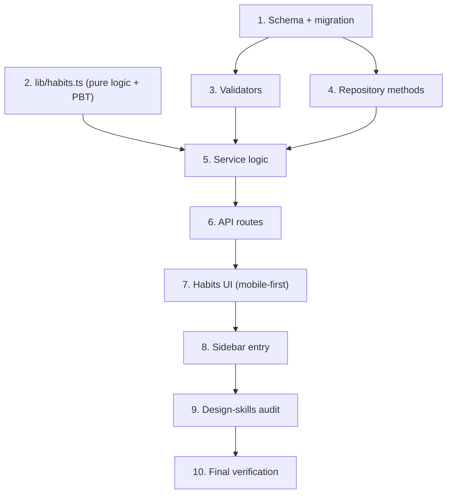

# Implementation Plan

## Overview

Implementation of the `habits-recurrence` feature (Spec 4), built bottom-up so
each layer's tests land with (or before) its implementation: schema/migration →
pure recurrence logic (property-tested) → validators → repository → service → API
routes → mobile-first accessible UI → sidebar wiring → design-skills audit → full
verification. Occurrences are computed by pure helpers, completions live in the
new `HabitCompletion` table, and adherence (streak + weekly ratio) is computed,
never stored. Habits stay off the calendar in this phase.

## Task Dependency Graph



```json
{
  "waves": [
    { "wave": 1, "tasks": ["1", "2"] },
    { "wave": 2, "tasks": ["3", "4"] },
    { "wave": 3, "tasks": ["5"] },
    { "wave": 4, "tasks": ["6"] },
    { "wave": 5, "tasks": ["7"] },
    { "wave": 6, "tasks": ["8"] },
    { "wave": 7, "tasks": ["9"] },
    { "wave": 8, "tasks": ["10"] }
  ]
}
```

## Tasks

- [x] 1. Schema and migration for recurrence columns and the completions table
  - Add the nullable recurrence columns to `PlanningItem` in `src/prisma/schema.prisma`: `recurrenceDays Int[] @map("recurrence_days")`, `recurrenceTimeMinutes Int? @map("recurrence_time_minutes")`, `recurrenceInterval Int? @map("recurrence_interval")`, `recurrenceAnchor DateTime? @map("recurrence_anchor") @db.Date`.
  - Add the `HabitCompletion` model (id, userId, planningItemId, `date @db.Date`, `completedAt`) with `@@unique([planningItemId, date])`, `@@index([userId])`, `@@index([planningItemId, date])`, `@@map("habit_completions")`, and cascade relations to `User` and `PlanningItem`.
  - Add the `habitCompletions HabitCompletion[]` relation to both `PlanningItem` and `User`, and add `@@index([userId, itemTypeId])` to `PlanningItem`.
  - Write the hand-written additive migration (style of `add_objective_fields`): array column defaults to `'{}'`, all other new columns nullable, create table + unique index + FKs; no backfill.
  - Regenerate the Prisma client.
  - _Requirements: 1.1, 1.9, 4.7, 8.9, 9.5_

- [x] 2. Pure recurrence logic in `src/lib/habits.ts`
- [x] 2.1 Encoding/normalization helpers with property tests
  - Implement `isoWeekday`, `normalizeDate`, `dateKey`, `minutesToHm`/`hmToMinutes`, `resolveAnchor`, and weekday normalization (distinct + ascending).
  - Add property tests in `src/lib/habits.test.ts` for Property 1 (weekday normalization) and Property 8 (time-of-day encoding round-trip) with fast-check.
  - Promote `fast-check` to an explicit `devDependency`.
  - _Requirements: 1.2, 1.6_
- [x] 2.2 Occurrence generation `generateOccurrences(rule, from, to)` with property + model-based tests
  - Implement the pure, DST-safe day-stepping generator supporting weekday-only, interval-only, and combined (AND) rules; half-open `[from, to)`; returns `[]` for `from >= to` or interval `< 1`.
  - Implement `isScheduledOn(rule, date)` in terms of the generator's predicate.
  - Add property tests for Property 9 (normalized/in-window/ordered/deduped/pure) and Property 10 (exact predicate membership), including a model-based reference generator.
  - _Requirements: 3.1, 3.2, 3.3, 3.4, 3.5, 3.6, 3.7, 3.8_
- [x] 2.3 Streak and weekly adherence with property + model-based tests
  - Implement `computeStreak(rule, completedKeys, today)` (bounded lookback, newest-first count to first gap) and `computeWeeklyAdherence(rule, completedKeys, now)` (Mon 00:00 → next Mon 00:00 local).
  - Add property tests for Property 11 (streak) with a naive backward-scan model, and Property 12 (weekly, completed ≤ total, 0/0 empty week).
  - Add unit tests for the Monday boundary, Sunday 23:59 vs next-Monday 00:00, `from == to`, only-occurrence-is-today, uncompleted head (streak 0).
  - _Requirements: 5.1, 5.2, 5.3, 5.4, 5.5, 5.6, 5.7, 6.1, 6.2, 6.3, 6.4, 6.5, 6.6_

- [x] 3. Recurrence validators in `src/validators/planning-item.schema.ts`
  - Extend create and update schemas with `recurrenceDays` (distinct ISO 1..7, max 7), `recurrenceInterval` (int 1..365), `recurrenceTimeMinutes` (int 0..1439), `recurrenceAnchor` (date); update fields nullable-optional (clearable).
  - Add the cross-field refine "at least one weekday OR an interval" applied for `habito`.
  - Add `habitCompletionSchema` validating `date` as `YYYY-MM-DD`.
  - Add property tests for Properties 3, 4, 5, 6, 7 (rejection classes) and the acceptance half of Property 2.
  - _Requirements: 2.1, 2.2, 2.3, 2.4, 2.5, 9.6_

- [x] 4. Repository methods in `src/repositories/planning-item.repository.ts` (sole Prisma boundary)
  - `listHabitsByUser(userId)`: `habito`-key, live (`deletedAt: null, archived: false`), joined to `List → Category`, `include`-ing `habitCompletions`; flattened result shape.
  - `findOwnedHabit(userId, id)`: filters `itemType.key = "habito"`; returns `null` when absent/foreign/non-habit.
  - `createHabitCompletion(userId, planningItemId, date)`: insert; catch `P2002` and treat as success (idempotent).
  - `deleteHabitCompletion(planningItemId, date)`: `deleteMany`; zero rows = success.
  - Add repository tests: live-filter/user-scoping/completions include, and DB-level idempotency of create/delete.
  - _Requirements: 4.1, 4.2, 4.4, 4.7, 7.1, 8.2, 8.3, 8.9, 9.5_

- [x] 5. Service logic in `src/services/planning-item.service.ts`
- [x] 5.1 `validateRecurrenceRule` on the effective rule + thread fields through create/update
  - Validate the effective (stored merged with patch) rule only when the item type is `habito`; reject invalid rules before any write so the prior rule is retained; keep habits out of `assertNoTimedOverlap` and never derive `startAt` from the rule.
  - Add service unit tests (repository mocked) for partial-PATCH effective-rule validation (prior rule retained on rejection).
  - _Requirements: 1.3, 1.5, 1.7, 1.8, 9.2, 9.6_
- [x] 5.2 `listHabitsForCurrentUser` and `setHabitCompletionForCurrentUser`
  - `listHabitsForCurrentUser(now)`: resolve user; call `listHabitsByUser`; build `RecurrenceRule` + compute `streak`, `weekly`, `scheduledToday`, `completedToday` per habit.
  - `setHabitCompletionForCurrentUser(id, dateStr, done)`: resolve user; `findOwnedHabit` → `NotFoundError` when foreign/missing; parse normalized date; `isScheduledOn` → `ValidationError` when not scheduled; then create or delete completion.
  - Add service tests for ownership rejection (Requirement 4.6) and non-scheduled-date rejection (Property 15), plus a fault-injection test for completion-write failure surfacing an error with no partial state.
  - _Requirements: 4.1, 4.3, 4.5, 4.6, 4.8, 7.2, 8.4, 8.5, 9.7_

- [x] 6. API routes
- [x] 6.1 `GET /api/habits`
  - Thin handler mirroring `GET /api/objectives`: `200` with array (incl. empty), `401` unauthenticated with no data, `500` no-leak on failure.
  - Add route tests for the four cases.
  - _Requirements: 8.1, 8.6, 8.7, 8.8_
- [x] 6.2 `POST` / `DELETE /api/habits/[id]/completions`
  - Validate body with `habitCompletionSchema`; call `setHabitCompletionForCurrentUser(id, date, true|false)`; map `ValidationError`→400, `UnauthorizedError`→401, `NotFoundError`→404, else 500; success `200`/`204` with a small confirmation.
  - Add route tests for success, 400 (bad body / not scheduled), 401, 404, 500.
  - _Requirements: 4.1, 4.3, 4.5, 4.6_
- [x] 6.3 Thread recurrence fields through the existing `/api/planning-items` write path
  - Ensure `POST/PATCH/DELETE /api/planning-items` carry the new recurrence fields end-to-end (no new write endpoint for the habit row).
  - Update the existing planning-items create/update tests whose exact `create`/`update` object match will change with the new fields.
  - _Requirements: 9.1, 9.2, 9.3, 9.4_

- [x] 7. Habits UI (mobile-first, accessible — honor `.agents/skills/responsive-design`)
- [x] 7.1 `src/app/(app)/habits/page.tsx` and `src/components/habits/habits-view.tsx`
  - Server `page.tsx` under `(app)` (inherits sidebar shell + `auth()` guard), rendering `<HabitsView />` in a centered, fluid column mirroring `objectives/page.tsx`.
  - `habits-view.tsx` (client): fetch `GET /api/habits`; render loading, error state ("couldn't load", keeps prior list, no empty-state), empty-state ("no habits yet", no error), and the list.
  - Mobile-first layout with no horizontal overflow; list uses responsive CSS Grid/Flex; fluid spacing.
  - _Requirements: 7.1, 7.6, 7.8_
- [x] 7.2 `src/components/habits/habit-card.tsx`
  - Render title, section (category) name, streak (whole number), weekly adherence "X of Y this week", and the mark-today control; when today is not scheduled show "Not scheduled today" and render no toggle.
  - Mark-today control and any interactive element meet the ≥44×44px touch-target minimum; accessible labels and keyboard operability; optimistic re-derivation of streak/weekly on toggle (<1s), reconciled with the server.
  - Add component tests for scheduled vs not-scheduled rendering, streak/weekly display, and optimistic update.
  - _Requirements: 7.2, 7.3, 7.4, 7.5_
- [x] 7.3 `src/components/habits/habit-form-dialog.tsx`
  - Create/edit form: title (1..200), description (0..2000), section (list grouped by category), weekday multi-select toggle group (produces `number[]`), time-of-day input, optional interval.
  - GOTCHA: keep interval and time as string form fields and convert/clamp on submit (as `objective-form-dialog.tsx` does for `progress`).
  - Weekday toggle group is an accessible, keyboard-operable group (aria semantics, visible focus) with ≥44px targets; mobile-first, no horizontal overflow.
  - Write through the existing `/api/planning-items` endpoints.
  - _Requirements: 9.1, 9.2, 9.3, 9.4_

- [x] 8. Sidebar navigation entry
  - Add a "Habits" `SidebarMenuButton` (icon `Repeat`) linking to `/habits` in `src/components/layout/app-sidebar.tsx`, next to Objectives.
  - _Requirements: 7.7_

- [x] 9. Audit the habits UI against the design skills
  - Review the new habits components (`habits-view`, `habit-card`, `habit-form-dialog`, `page.tsx`) against `.agents/skills/responsive-design` best practices: mobile-first, content breakpoints, fluid type/spacing, no horizontal overflow, ≥44px touch targets, accessible responsive data display; fix any gaps found.
  - Run the `web-design-guidelines` skill: fetch the Vercel Web Interface Guidelines and report/fix `file:line` findings over the new habits component files (accessibility, semantics, keyboard, focus, contrast).
  - _Requirements: 7.2, 7.3, 7.4, 7.5, 7.6, 7.7, 7.8_

- [x] 10. Final verification
  - Run `tsc`, lint, the full test suite, and the production build; fix any failures so all gates are green.
  - _Requirements: 1.1, 2.5, 3.1, 4.1, 5.1, 6.1, 7.1, 8.1, 9.1_

## Notes

- Property numbers reference the "Correctness Properties" section of `design.md`
  (15 properties). Property-based tests use fast-check with a model-based
  reference for `generateOccurrences` and `computeStreak`.
- The repository is the sole Prisma boundary; no service, route, or component
  touches Prisma directly. Everything is scoped to the authenticated `userId`.
- Out of scope (future phases): habits on the calendar (layer + toggle), recurring
  reminders, and full iCalendar RRULE support.
