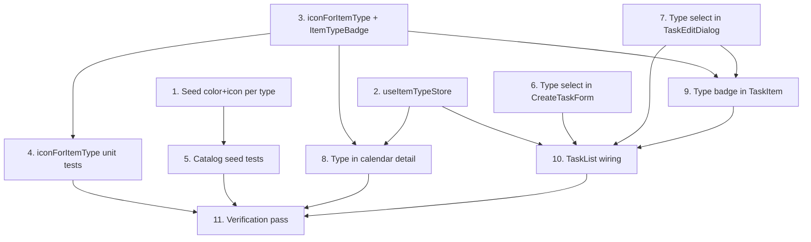

# Implementation Plan

## Overview

Surface the item type in the UI. The only backend change is seeding a color and
icon per type; everything else is frontend. Work starts with three independent
foundations (seed, catalog store, badge + icon helper), then wires the type into
the create form, the edit sheet, and the calendar detail, and finally the task
list ties the pieces together. No schema or route changes — `itemTypeId` is
already accepted end-to-end and the catalog endpoint already returns color/icon.

## Task Dependency Graph



```json
{
  "waves": [
    { "wave": 1, "tasks": ["1", "2", "3"] },
    { "wave": 2, "tasks": ["4", "5", "6", "7", "8"] },
    { "wave": 3, "tasks": ["9"] },
    { "wave": 4, "tasks": ["10"] },
    { "wave": 5, "tasks": ["11"] }
  ]
}
```

## Tasks

### Phase 1 — Foundations

- [x] 1. Seed a color and icon for each item type
  - In `src/prisma/seed.ts`, add `color` and `icon` to each `ITEM_TYPES` entry: tarea `#3B82F6`/`ListChecks`, recordatorio `#F59E0B`/`Bell`, evento `#A855F7`/`CalendarClock`, habito `#22C55E`/`Repeat`, objetivo `#EF4444`/`Target`, nota `#6B7280`/`StickyNote`. The upsert is keyed by `key` and passes the whole object to `update`, so re-seeding stays idempotent. (Run `pnpm db:seed` during verification.)
  - _Requirements: 4.1, 4.2_

- [x] 2. Add the item-type catalog store
  - Create `src/stores/item-type-store.ts` (`useItemTypeStore`) mirroring `useWorkspaceStore`: `itemTypes: ItemType[]`, `status`, a guarded `ensureLoaded()` and `reload()` that `GET /api/item-types`. In-memory, session-scoped. Holds only the catalog.
  - _Requirements: 1.1, 3.1_

- [x] 3. Add iconForItemType and ItemTypeBadge
  - Create `src/components/tasks/item-type-badge.tsx` with `iconForItemType(iconName: string | null): LucideIcon` — an explicit `Record<string, LucideIcon>` for the six seeded names (ListChecks, Bell, CalendarClock, Repeat, Target, StickyNote) with a `Tag` fallback for unknown/empty/null — and `ItemTypeBadge({ itemType }: { itemType: ItemType })` rendering the icon tinted with `itemType.color` (fallback `currentColor`) plus the name. Small, inline, legible.
  - _Requirements: 3.1, 3.3, 3.4_

### Phase 2 — Tests and per-surface wiring

- [x] 4. Unit-test iconForItemType
  - Create `src/components/tasks/item-type-badge.test.ts` (or `.tsx`): returns a defined component for each seeded icon name; returns the fallback for an unknown name, empty string, and null; never returns undefined.
  - _Requirements: 3.4_

- [x] 5. Extend catalog tests for seeded appearance
  - In the catalog repository/service test (`src/repositories/catalog.repository.test.ts` and/or `src/services/catalog.service.test.ts`), assert that every active item type returned carries a non-null `color` and `icon` and that the six colors are distinct. Mirror the existing catalog test conventions.
  - _Requirements: 4.1, 4.2, 4.3_

- [x] 6. Add a type select to CreateTaskForm
  - In `src/components/tasks/create-task-form.tsx`, add an `itemTypes: ItemType[]` prop and a compact type `<Select>` beside the title input. Extend the schema with `itemTypeId: z.string()`, defaulting to the catalog's `isDefault` type id (fall back to the first type if none is flagged). Change `onCreate` to `onCreate(title: string, itemTypeId: string)` and pass the chosen id. Reset to the default type after submit.
  - _Requirements: 1.1, 1.2, 1.4_

- [x] 7. Add a type select to TaskEditDialog
  - In `src/components/tasks/task-edit-dialog.tsx`, add `itemTypes: ItemType[]` to the props, `itemTypeId: z.string()` to `editTaskSchema` (defaulted from `item.itemTypeId`), a Type `<Select>` field (same shape as the List/Priority selects), and `itemTypeId: string` to `TaskEditPayload` + the submit payload. No other payload fields change, so a type change touches only the type.
  - _Requirements: 2.1, 2.2, 2.3, 2.4_

- [x] 8. Show the type in the calendar detail sheet
  - Extend `CalendarEvent` (`src/lib/calendar.ts`) with optional `itemTypeId?: string`, and populate it in `toCalendarEvents` and `toCombinedCalendarEvents` from the row's `itemTypeId`. In `category-calendar.tsx` and `combined-calendar.tsx`, call `useItemTypeStore().ensureLoaded()`, resolve `peekEvent.itemTypeId` → `ItemType` (memoized map), and render `<ItemTypeBadge/>` inside the `<DetailSheet/>`. Do NOT add a badge to the chips.
  - _Requirements: 3.2_

### Phase 3 — Task row

- [x] 9. Render the type badge in TaskItem
  - In `src/components/tasks/task-item.tsx`, accept the item's resolved `ItemType` (or an `itemTypes`/`itemTypeById` lookup) and render `<ItemTypeBadge/>` in the meta row alongside status/list/priority. Pass `itemTypes` through to `TaskEditDialog`.
  - _Requirements: 3.1, 3.3_

### Phase 4 — List container

- [x] 10. Wire the catalog through TaskList
  - In `src/components/tasks/task-list.tsx`, call `useItemTypeStore().ensureLoaded()` and read `itemTypes`; build an `itemTypeById` map; pass `itemTypes` to `CreateTaskForm` and `TaskItem`. Update `handleCreate(title, itemTypeId)` to `POST /api/planning-items` with `{ title, listId, itemTypeId }`. Only active types are offered.
  - _Requirements: 1.3, 3.1, 5.3_

### Phase 5 — Verification

- [x] 11. Full verification pass
  - Run `pnpm db:seed` (lands the new colors/icons), then `pnpm exec tsc --noEmit`, `pnpm lint`, `pnpm test`, `pnpm build` all green (clear `.next` if a stale route type error appears). Manual smoke: create an item with a chosen type → persists and shows the badge; edit changes the type without touching other fields; the badge shows in the list and the calendar detail sheet; an unknown/empty icon still renders the name; an unknown `itemTypeId` is rejected.
  - _Requirements: 1.2, 1.3, 2.2, 2.3, 3.1, 3.2, 3.4, 4.1, 5.1_

## Notes

- **No schema/route changes**: `itemTypeId` is already accepted on `POST`/`PATCH`
  and the unknown-id → 404 path already exists (Req 5.1). Only the seed and the
  frontend change.
- **Single catalog source**: `useItemTypeStore` is the one place the list and
  both calendars read item types from, avoiding duplicate fetches.
- **Calendar chips stay category-colored** (D3); the type appears only in the
  detail sheet to avoid clashing with the category color.
- **Out of scope**: type-driven behavior (reminders, progress, recurrence) —
  later specs.
- **Workflow**: committed directly to `main` (no branch/PR) per the current
  request. Conventional commits, no AI attribution; keep the suite green.
- **Numbering** follows the dependency waves (parallelizable within a wave).
