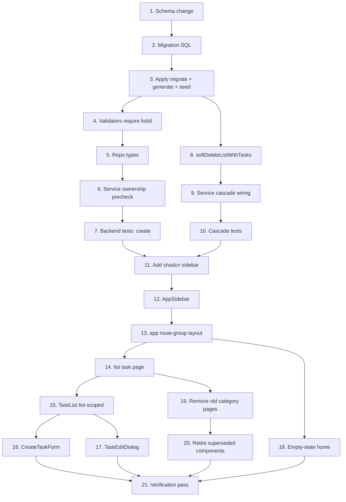

# Implementation Plan

## Overview

Incremental plan to enforce the `Category → List → Task` hierarchy and unify
navigation behind a persistent sidebar. Work flows backend-first (data →
validators/services → tests), then frontend (sidebar shell → list-scoped views),
then cleanup and a full verification pass. Each phase leaves the app building and
green so it can be committed as a reviewable unit.

## Task Dependency Graph



```json
{
  "waves": [
    { "wave": 1, "tasks": ["1"] },
    { "wave": 2, "tasks": ["2"] },
    { "wave": 3, "tasks": ["3"] },
    { "wave": 4, "tasks": ["4", "8"] },
    { "wave": 5, "tasks": ["5", "9"] },
    { "wave": 6, "tasks": ["6", "10"] },
    { "wave": 7, "tasks": ["7"] },
    { "wave": 8, "tasks": ["11"] },
    { "wave": 9, "tasks": ["12"] },
    { "wave": 10, "tasks": ["13"] },
    { "wave": 11, "tasks": ["14", "18"] },
    { "wave": 12, "tasks": ["15", "19"] },
    { "wave": 13, "tasks": ["16", "17", "20"] },
    { "wave": 14, "tasks": ["21"] }
  ]
}
```

## Tasks

### Phase 1 — Data layer (mandatory hierarchy + cascade FK)

- [x] 1. Update the Prisma schema for a required, cascading list relation
  - In `src/prisma/schema.prisma`, change `PlanningItem.listId` from `String?`
    to `String`, and the `list` relation from `List? … onDelete: SetNull` to
    `List … onDelete: Cascade`.
  - _Requirements: 1.4, 2.3_

- [x] 2. Write the hand-written migration
  - Create `src/prisma/migrations/<timestamp>_planning_items_require_list/migration.sql`.
  - Steps in order: (a) `DELETE FROM "planning_items" WHERE "listId" IS NULL;`
    (b) `ALTER COLUMN "listId" SET NOT NULL;` (c) drop the existing
    `planning_items_listId_fkey` and re-add it with `ON DELETE CASCADE`.
    Note: the physical column is `"listId"` (camelCase, no `@map`).
  - Confirm the current FK constraint name from the generated `_init` migration
    before writing the drop statement.
  - _Requirements: 1.4, 1.5, 2.3_

- [x] 3. Apply the migration and regenerate the client
  - Run `pnpm db:migrate` (dev DB up) then `pnpm db:generate`; re-seed with
    `pnpm db:seed` to confirm the seed still succeeds.
  - _Requirements: 1.4, 1.5_

### Phase 2 — Backend: require listId on task creation

- [x] 4. Make `listId` required in the planning-item validators
  - In `src/validators/planning-item.schema.ts`: `createPlanningItemSchema.listId`
    becomes required (`z.string().min(1, "listId is required")`);
    `updatePlanningItemSchema.listId` drops `.nullable()` (stays optional).
  - _Requirements: 1.1, 5.2_

- [x] 5. Update the planning-item repository types
  - In `src/repositories/planning-item.repository.ts`: `CreatePlanningItemData.listId`
    → `string`; `UpdatePlanningItemData.listId` → `string | undefined`.
  - _Requirements: 1.1, 5.2_

- [x] 6. Enforce list ownership on task creation in the service
  - In `src/services/planning-item.service.ts`, `createPlanningItemForCurrentUser`
    passes `listId: input.listId` and pre-checks ownership via `findOwnedList`
    (throw `NotFoundError` when the list is absent or not owned) before insert.
  - _Requirements: 1.2, 1.3, 4.5_

- [x] 7. Update/add backend tests for required listId
  - Validator: create without `listId` fails; update with `listId: null` fails.
  - Service/route: `POST /api/planning-items` → 400 without `listId`, 404 for a
    non-owned list, 201 for a valid owned list. Remove the old "detach to null"
    edit expectation.
  - _Requirements: 1.1, 1.2, 1.3, 5.2_

### Phase 3 — Backend: cascade soft-delete on list deletion

- [x] 8. Add `softDeleteListWithTasks` in the list repository
  - In `src/repositories/list.repository.ts`, add a function that wraps two
    writes in `prisma.$transaction`: `updateMany` to set `deletedAt` on active
    tasks with that `listId`, then `update` to set `deletedAt` on the list.
    Remove `softDeleteList` if it has no remaining callers.
  - _Requirements: 2.1, 2.4_

- [x] 9. Wire the cascade into the list service
  - In `src/services/list.service.ts`, `deleteListForCurrentUser` calls
    `softDeleteListWithTasks` (ownership precheck unchanged).
  - _Requirements: 2.1, 2.2_

- [x] 10. Add cascade tests
  - Repository: `softDeleteListWithTasks` soft-deletes the list and its active
    tasks in one transaction; already-deleted tasks are untouched.
  - Route: `DELETE /api/lists/[id]` removes the list's tasks from subsequent
    task reads.
  - _Requirements: 2.1, 2.2, 2.4_

### Phase 4 — Frontend: sidebar shell and layout

- [x] 11. Add the shadcn sidebar block
  - Run `npx shadcn@latest add sidebar-07`. If it fails to resolve for the
    `base-nova` (Base UI) style, fall back to `npx shadcn@latest add sidebar`
    and compose the shell manually. Verify with `pnpm build`.
  - _Requirements: 3.1_

- [x] 12. Build the `AppSidebar` component
  - Create `src/components/layout/app-sidebar.tsx`: categories as collapsible
    `SidebarMenu` groups, lists as `SidebarMenuSub` links to `/lists/[listId]`,
    an "add category" control and a per-group "add list" control (reuse
    `CategoryFormDialog` / `ListFormDialog`), and a footer with the signed-in
    user + `SignOutButton`. Client-side create/rename/delete update the tree
    without a full reload.
  - _Requirements: 3.2, 3.3, 3.4, 3.5, 3.6, 3.7_

- [x] 13. Add the authenticated route group layout
  - Create `src/app/(app)/layout.tsx` (server component): call `auth()`, render
    `SidebarProvider` + `<AppSidebar>` + `<SidebarInset>{children}</SidebarInset>`.
  - _Requirements: 3.1, 3.6_

### Phase 5 — Frontend: list-scoped task view

- [x] 14. Create the list task page
  - Add `src/app/(app)/lists/[listId]/page.tsx` (RSC): resolve the list via
    `getListForCurrentUser(listId)`, call `notFound()` on `NotFoundError`, then
    render the list-scoped `TaskList`.
  - _Requirements: 4.1, 4.5_

- [x] 15. Refactor `TaskList` to be list-scoped
  - Accept a required `listId` prop; show only that list's tasks; drop the
    list-filter UI (keep "hide completed"); POST new tasks with `listId`.
  - _Requirements: 4.1, 4.2, 4.4_

- [x] 16. Refactor `CreateTaskForm` for list context
  - Parent `TaskList` injects `listId` into the create payload; the form keeps
    its title-only input contract.
  - _Requirements: 4.2_

- [x] 17. Adjust `TaskEditDialog` list selector
  - Keep the "move to another list" selector; remove the "none/unassigned"
    option so a task can never be detached from all lists.
  - _Requirements: 5.1, 5.2, 5.3_

- [x] 18. Add the empty-state home
  - Update `src/app/(app)/page.tsx` to show an empty state prompting the user to
    select or create a list.
  - _Requirements: 4.3_

### Phase 6 — Cleanup and migration of old pages

- [x] 19. Remove the old category pages
  - Delete `src/app/categories/page.tsx` and `src/app/categories/[id]/page.tsx`.
    Ensure no dead links remain (the old home "Categories" link is gone with the
    home refactor). Confirm removed routes 404 cleanly.
  - _Requirements: 6.1, 6.2, 6.3_

- [x] 20. Retire superseded components
  - Remove or repurpose `ListManager` (category-detail list CRUD) now that the
    sidebar owns list management. Remove the now-unused list-filter pieces from
    `TaskFilters` if fully superseded.
  - _Requirements: 6.1, 6.2_

### Phase 7 — Verification

- [x] 21. Full verification pass
  - `pnpm build` (catches Base UI/Radix sidebar typing issues), `pnpm test`
    (all green), `pnpm lint` (clean).
  - Runtime smoke test: create category → create list in sidebar → open list →
    create task → move task to another list → delete list and confirm its tasks
    disappear; confirm task creation without a list is rejected.
  - _Requirements: 1.1, 1.2, 2.1, 2.2, 3.5, 4.1, 4.2, 5.3, 6.3_

## Notes

- **Soft-delete vs DB cascade**: the `ON DELETE CASCADE` FK (task 2) only fires
  on hard deletes; the app's soft-delete path relies on `softDeleteListWithTasks`
  (task 8). Both are required — see design "Key constraint".
- **Migration is destructive** to orphaned dev tasks (`list_id IS NULL`); the
  seed creates none, so impact is limited to manually created dev data.
- **Sidebar block risk**: `sidebar-07` targets Radix; this project uses Base UI
  (`base-nova`). Task 11 includes a fallback and a build check.
- **Commit boundaries**: Phases 1–3 (backend) and Phases 4–6 (frontend) are
  natural commit units; keep the suite green at each boundary. Conventional
  commits, no AI attribution.
- **React component tests** remain a known gap (no UI test framework yet) and are
  out of scope for this change.
