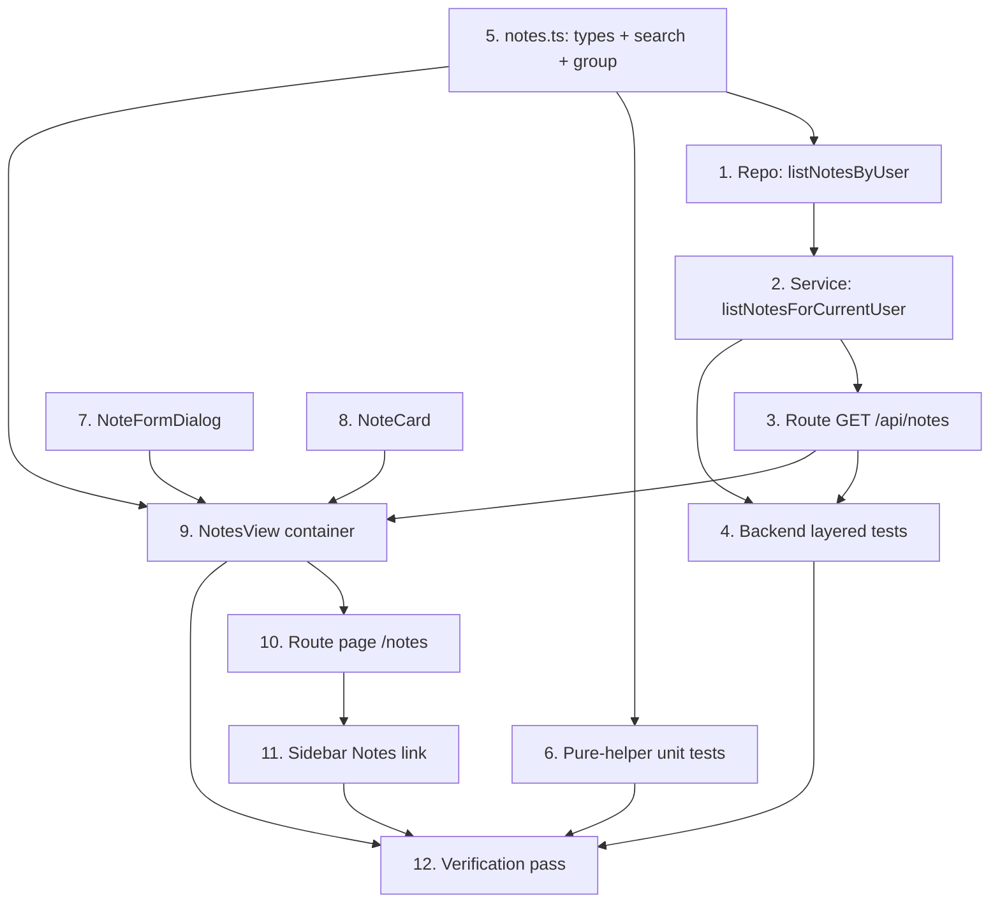

# Implementation Plan

## Overview

Add a dedicated Notes view. Work splits into a **backend** track (a `nota`-typed,
category-joined read query + its service + route + tests), a **pure-logic** track
(the `NoteWithCategory`/`NoteSection` types, title search, and category grouping
— unit-tested), and a **UI** track (the notes view container with local state +
optimistic writes, a note card, a create/edit form dialog, the route page, and a
sidebar link). No schema changes — a note is a `nota`-type `PlanningItem`; writes
reuse the existing `/api/planning-items` endpoints; sections reuse categories.

## Task Dependency Graph



```json
{
  "waves": [
    { "wave": 1, "tasks": ["5", "7", "8"] },
    { "wave": 2, "tasks": ["1", "6", "9"] },
    { "wave": 3, "tasks": ["2", "10"] },
    { "wave": 4, "tasks": ["3", "11"] },
    { "wave": 5, "tasks": ["4"] },
    { "wave": 6, "tasks": ["12"] }
  ]
}
```

## Tasks

### Phase 1 — Pure foundations and presentational pieces

- [x] 5. Add the notes types and pure helpers
  - Create `src/lib/notes.ts` with `NoteWithCategory extends PlanningItem` (`categoryId`, `categoryName`, `categoryColor: string | null`) and `NoteSection` (`categoryId`, `categoryName`, `categoryColor`, `notes: NoteWithCategory[]`). Add `filterNotesByTitle(notes, query): NoteWithCategory[]` (trim + lower-case substring match on title; empty/whitespace query → all notes) and `groupNotesByCategory(notes): NoteSection[]` (group by `categoryId`, preserve note order within a section, emit sections in first-appearance order, every note in exactly one section). Pure — no clock, no I/O.
  - _Requirements: 1.2, 1.3, 2.1, 2.3_

- [x] 7. Build the NoteFormDialog (create/edit)
  - Create `src/components/notes/note-form-dialog.tsx`: a `FormSheet`-based form with `title` (required, ≤ 500), `description` (textarea, optional, ≤ 2000), and a **section** select — a list picker grouped by category reusing `TaskEditDialog`'s pattern (`SelectGroup`/`SelectLabel` = category, `SelectItem` = list). Takes `categories`, `lists`, an optional `note` (edit mode), and `onSubmit(payload) => Promise<boolean>`; resolves/closes on success. Zod-validated.
  - _Requirements: 3.1, 4.1_

- [x] 8. Build the NoteCard
  - Create `src/components/notes/note-card.tsx`: presentational card showing the note title and a clamped body preview, with edit and delete affordances delegated via props (`onEdit`, `onDelete`). No data fetching.
  - _Requirements: 1.4_

### Phase 2 — Repository, pure tests, and the container

- [x] 1. Add the notes range query to the repository
  - In `src/repositories/planning-item.repository.ts`, add `listNotesByUser(userId): Promise<NoteWithCategory[]>`: `where` = `userId`, `deletedAt: null`, `archived: false`, `itemType: { key: "nota" }`, live `list` + `category: { userId, deletedAt: null }`. Use `include: { list: { select: { category: { select: { id: true, name: true, color: true } } } } }`, flatten each row to `NoteWithCategory` (spread `PlanningItem` fields + `categoryId`/`categoryName`/`categoryColor`). Order `updatedAt desc`. Import `NoteWithCategory` from `src/lib/notes.ts` (type-only).
  - _Requirements: 5.1, 5.2, 5.3, 5.5, 6.1_

- [x] 6. Unit-test the pure helpers
  - Create `src/lib/notes.test.ts`: `filterNotesByTitle` (case-insensitive substring; trims the query; empty/whitespace → all; no match → empty); `groupNotesByCategory` (every note grouped exactly once; order preserved within a section; sections equal the distinct categories present; empty input → empty array).
  - _Requirements: 1.2, 1.3, 2.1, 2.3_

- [x] 9. Build the NotesView container
  - Create `src/components/notes/notes-view.tsx` (client), mirroring `TaskList`'s local-state + optimistic pattern: on mount `ensureLoaded()` on the workspace store (categories + lists) and the item-type store (resolve the `nota` type id via `itemTypes.find(t => t.key === "nota")`); fetch `GET /api/notes` into state. A search `Input` bound to `query`; compute `groupNotesByCategory(filterNotesByTitle(notes, query))` and render each section (category name + `resolveCategoryColor` swatch) with a stack of `<NoteCard/>`. Create via `<NoteFormDialog mode="create"/>` → `POST /api/planning-items { title, description, listId, itemTypeId: notaTypeId }` → prepend on success; disable create with a hint when the user has no lists. Edit via `<NoteFormDialog mode="edit"/>` → `PATCH /api/planning-items/[id] { title, description, listId }` → replace in state. Delete → optimistic remove + `DELETE /api/planning-items/[id]` → revert + `toast.error` on failure. Empty state (no notes) and no-match state (search) are neutral, never errors.
  - _Requirements: 1.1, 1.3, 1.4, 1.5, 2.2, 2.4, 3.2, 3.3, 3.4, 3.5, 4.2, 4.3, 4.4, 4.5, 6.2, 6.4_

### Phase 3 — Service and route page

- [x] 2. Add the notes service function
  - In `src/services/planning-item.service.ts`, add `listNotesForCurrentUser(): Promise<NoteWithCategory[]>` that resolves the acting user via `getCurrentUserId()` and delegates to `listNotesByUser`. No new create/update/delete service functions — notes reuse the existing planning-item service functions through the existing routes.
  - _Requirements: 5.1, 5.4_

- [x] 10. Add the /notes route page
  - Create `src/app/(app)/notes/page.tsx` as a server component (inherits the `(app)` sidebar shell + `auth()` guard) rendering `<NotesView/>` in a centered content column consistent with the list task page.
  - _Requirements: 1.1, 1.6_

### Phase 4 — Route and navigation

- [x] 3. Add the notes read route
  - Create `src/app/api/notes/route.ts`: thin `GET` calling `listNotesForCurrentUser`, returning the array with 200. Reuse the shared `mapErrorToResponse` contract (UnauthorizedError → 401, else 500). No Prisma, no business logic.
  - _Requirements: 5.1, 5.4_

- [x] 11. Add the Notes link to the sidebar
  - In `src/components/layout/app-sidebar.tsx`, add a top-level "Notes" `SidebarMenuButton` (a `StickyNote` icon linking to `/notes`, `isActive` when `pathname === "/notes"`) in the same `SidebarGroup` as the Calendar link.
  - _Requirements: 1.6_

### Phase 5 — Backend tests

- [x] 4. Add backend layered tests for notes
  - Repository (`planning-item.repository.test.ts`): `listNotesByUser` returns only `nota`-type live items with category id/name/color; excludes a `tarea`-type item, a deleted note, an archived note, and another user's note; ordered by `updatedAt desc`. Resolve the `nota` item type id from the seed (`itemType.findUniqueOrThrow({ where: { key: "nota" } })`) and create items under the throwaway list; idempotent cleanup. Service (`planning-item.service.test.ts`): `listNotesForCurrentUser` delegates with the resolved user. Route: create `src/app/api/notes/route.test.ts` (200 with the notes; 401 unauthenticated) mirroring the calendar route test.
  - _Requirements: 5.1, 5.2, 5.3, 5.4, 5.5_

### Phase 6 — Verification

- [x] 12. Full verification pass
  - `pnpm exec tsc --noEmit`, `pnpm lint`, `pnpm test`, `pnpm build` all green (clear `.next` on a stale route type error). Manual smoke test: `/notes` shows notes stacked under category sections newest-first; the sidebar "Notes" link routes here; title search filters case-insensitively and hides empty sections, clearing restores all; creating a note adds it to its section; editing its title/body updates in place and changing its list moves its section; deleting removes it (reverts on error); a task never appears among the notes.
  - _Requirements: 1.1, 1.2, 1.3, 1.4, 1.6, 2.1, 2.2, 2.3, 3.2, 3.3, 4.2, 4.4, 5.5_

## Notes

- **Reuse over reinvention**: sections = categories; note writes = existing
  `/api/planning-items` endpoints; only `GET /api/notes` + pure helpers + view
  are new. Notes are identified by the `nota` item-type key, not a hard-coded id.
- **Notes remain planning items**: still visible in their list's task view with
  the `nota` badge — intentionally not hidden.
- **Testability**: `filterNotesByTitle` and `groupNotesByCategory` are pure and
  unit-tested; the container is a thin interaction layer; backend gets layered
  tests (repo/service/route).
- **Workflow**: commit to `main`, conventional commits, no AI attribution, keep
  the suite green; numbering follows the dependency waves.
