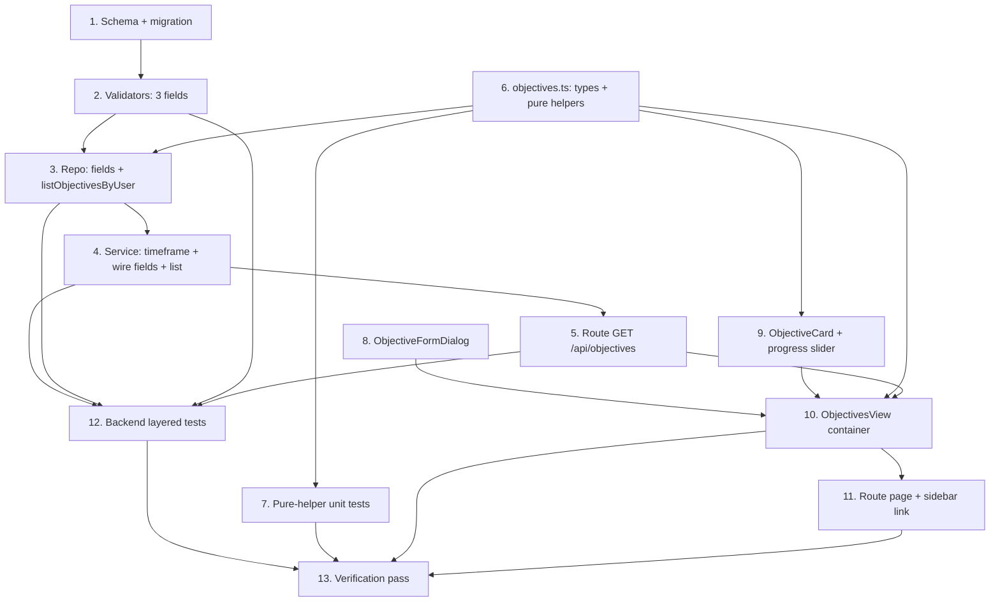

# Implementation Plan

## Overview

Add an Objectives view. Work splits into a **schema/backend** track (three new
columns + migration, a `objetivo`-typed deadline-ordered read query, the three
fields wired through the create/update path, service + route + tests), a
**pure-logic** track (`daysRemaining` / `clampProgress` / `objectiveStatus` +
types, unit-tested), and a **UI** track (the objectives view with local state +
optimistic writes, an objective card with an inline progress slider, a
create/edit form dialog, the route page, and a sidebar link). Objectives use
dedicated timeframe columns, so the calendar and no-overlap logic ignore them
with no changes — writes reuse `/api/planning-items`.

## Task Dependency Graph



```json
{
  "waves": [
    { "wave": 1, "tasks": ["1", "6", "8", "9"] },
    { "wave": 2, "tasks": ["2", "7", "10"] },
    { "wave": 3, "tasks": ["3", "11"] },
    { "wave": 4, "tasks": ["4"] },
    { "wave": 5, "tasks": ["5"] },
    { "wave": 6, "tasks": ["12"] },
    { "wave": 7, "tasks": ["13"] }
  ]
}
```

## Tasks

### Phase 1 — Schema, pure foundations, presentational pieces

- [x] 1. Add objective columns + migration
  - In `src/prisma/schema.prisma`, add to `PlanningItem`: `objectiveStartAt DateTime? @map("objective_start_at")`, `objectiveEndAt DateTime? @map("objective_end_at")`, `progress Int? @map("progress")`, plus `@@index([userId, objectiveEndAt])`. Run `pnpm db:migrate` (name e.g. `add_objective_fields`) and regenerate the client. All nullable, no default (backward-compatible).
  - _Requirements: 4.1_

- [x] 6. Add objectives types and pure helpers
  - Create `src/lib/objectives.ts` with `ObjectiveWithCategory extends PlanningItem` (`categoryId`, `categoryName`, `categoryColor`), `ObjectiveStatus` union, and: `daysRemaining(endAt: Date | null, now: Date): number | null` (signed whole local-calendar days, `null` when no end — reduce both to start-of-day); `clampProgress(value): number` (`Math.max(0, Math.min(100, Math.round(value)))`); `objectiveStatus(endAt, progress, now): ObjectiveStatus` (progress≥100→completed; else null end→no-deadline; else deadline before today→overdue; else active; null progress treated as 0). Pure — `now` injected.
  - _Requirements: 3.1, 3.2, 3.3, 3.4, 2.3_

- [x] 8. Build the ObjectiveFormDialog (create/edit)
  - Create `src/components/objectives/objective-form-dialog.tsx`: a `FormSheet` form with `title` (required ≤ 500), `description` (optional ≤ 2000), a **section** select (list grouped by category, reusing the notes/task pattern), `objectiveStartAt` + `objectiveEndAt` (`type="date"`), `progress` (number 0–100), and an optional reminder (`datetime-local`, reused `remindAt`). Zod-validated incl. `objectiveEndAt >= objectiveStartAt` when both present. Props: `mode`, optional `objective`, `categories`, `lists`, `trigger`, `onSubmit(payload) => Promise<boolean>`. Payload carries ISO-or-null dates, clamped `progress`, and ISO-or-null `remindAt`.
  - _Requirements: 5.1, 5.5_

- [x] 9. Build the ObjectiveCard with an inline progress slider
  - Create `src/components/objectives/objective-card.tsx`: title + category swatch + `objectiveStatus(...)` badge; a progress bar (`role="progressbar"`, `aria-valuenow/min/max`); a days line from `daysRemaining(...)` + status ("N days left" / "Overdue by N days" / "Completed" / "No deadline"); an inline range `input` (0–100) bound to local state that updates the bar on change and **commits** on `onPointerUp`/`onBlur`/Enter via `onProgressCommit(id, value)`; edit (opens the dialog) and delete (confirm `AlertDialog`) delegated via props.
  - _Requirements: 1.2, 2.1, 2.2, 3.1_

### Phase 2 — Validators, pure tests, container

- [x] 2. Add the three fields to the validators
  - In `src/validators/planning-item.schema.ts`: add to `createPlanningItemSchema` `objectiveStartAt: z.coerce.date().optional()`, `objectiveEndAt: z.coerce.date().optional()`, `progress: z.number().int().min(0).max(100).optional()`, plus a refine that `objectiveEndAt >= objectiveStartAt` when both present (path `objectiveEndAt`). Add to `updatePlanningItemSchema` the same three as `.nullable().optional()` (progress `.int().min(0).max(100).nullable().optional()`).
  - _Requirements: 2.3, 4.1, 4.2_

- [x] 7. Unit-test the pure helpers
  - Create `src/lib/objectives.test.ts`: `daysRemaining` (null end → null; deadline later today → 0; tomorrow → 1; yesterday → −1; ignores time-of-day within a day); `clampProgress` (−5 → 0; 150 → 100; 42.6 → 43; 0/100 boundaries); `objectiveStatus` (progress 100 with past deadline → completed; null end → no-deadline; past end + 50 → overdue; future end + 50 → active; null progress → treated as 0).
  - _Requirements: 2.3, 3.1, 3.2, 3.3, 3.4_

- [x] 10. Build the ObjectivesView container
  - Create `src/components/objectives/objectives-view.tsx` (client), mirroring `NotesView`: on mount `ensureLoaded()` on workspace + item-type stores (resolve the `objetivo` type id by key); fetch `GET /api/objectives` into state. Render the stack of `<ObjectiveCard/>` in the returned deadline order. Create via `<ObjectiveFormDialog mode="create"/>` → `POST /api/planning-items` with `{ title, description?, listId, itemTypeId: objetivoTypeId, objectiveStartAt, objectiveEndAt, progress, remindAt }`; edit → `PATCH /api/planning-items/[id]`; delete → optimistic remove + `DELETE`. `onProgressCommit(id, value)` → `PATCH /api/planning-items/[id] { progress: clampProgress(value) }` (optimistic, revert + toast on failure). Rebuild `ObjectiveWithCategory` from the returned item + workspace tree (a `toObjective` helper) and re-sort by `objectiveEndAt` (nulls last) client-side so a changed deadline reorders. Neutral empty state; disable create with a hint when the user has no lists.
  - _Requirements: 1.1, 1.2, 1.5, 2.2, 2.4, 5.2, 5.3, 5.6_

### Phase 3 — Repository and navigation

- [x] 3. Extend the repository (fields + objectives query)
  - In `src/repositories/planning-item.repository.ts`: add `objectiveStartAt?: Date | null`, `objectiveEndAt?: Date | null`, `progress?: number | null` to `CreatePlanningItemData` and `UpdatePlanningItemData`. Add `listObjectivesByUser(userId): Promise<ObjectiveWithCategory[]>`: `where` = `userId`, `deletedAt: null`, `archived: false`, `itemType: { key: "objetivo" }`, live `list` + `category: { userId, deletedAt: null }`; `include` the `List → Category` select; flatten to `ObjectiveWithCategory`; order `objectiveEndAt: { sort: "asc", nulls: "last" }`. Import `ObjectiveWithCategory` from `src/lib/objectives.ts` (type-only).
  - _Requirements: 6.1, 6.2, 6.3, 6.5_

- [x] 11. Add the route page and the sidebar link
  - Create `src/app/(app)/objectives/page.tsx` (server component, inherits the `(app)` shell) rendering `<ObjectivesView/>` in a centered content column. In `src/components/layout/app-sidebar.tsx`, add a top-level "Objectives" `SidebarMenuButton` (a `Target` icon → `/objectives`, `isActive` when `pathname === "/objectives"`) in the same group as Calendar and Notes.
  - _Requirements: 1.1, 1.6_

### Phase 4 — Service

- [x] 4. Wire the objective fields + timeframe validation into the service
  - In `src/services/planning-item.service.ts`: add `validateObjectiveTimeframe(start, end)` (mirrors `validateSchedule`: when both set, `end >= start` else `ValidationError`). In `createPlanningItemForCurrentUser`, run it on `input.objectiveStartAt`/`objectiveEndAt` and forward `objectiveStartAt ?? null`, `objectiveEndAt ?? null`, `progress ?? null`. In `updatePlanningItemForCurrentUser`, compute the EFFECTIVE start/end (stored overlaid with the patch, `null` = clear), run `validateObjectiveTimeframe`, and forward each of the three when present. Do NOT call `assertNoTimedOverlap` for these (objective dates are separate from `startAt`/`endAt`). Add `listObjectivesForCurrentUser(): Promise<ObjectiveWithCategory[]>` delegating to `listObjectivesByUser`.
  - _Requirements: 4.2, 4.3, 4.4, 5.2, 6.1_

### Phase 5 — Route

- [x] 5. Add the objectives read route
  - Create `src/app/api/objectives/route.ts`: thin `GET` calling `listObjectivesForCurrentUser`, returning the array with 200. Reuse the shared `mapErrorToResponse` contract (UnauthorizedError → 401, else 500). No Prisma, no business logic.
  - _Requirements: 6.1, 6.4_

### Phase 6 — Backend tests

- [x] 12. Add backend layered tests
  - Repository (`planning-item.repository.test.ts`): `listObjectivesByUser` returns only `objetivo` live items with category; excludes a non-objective, deleted, archived, and another user's objective; ordered by `objectiveEndAt asc` with a null-deadline objective LAST. Resolve the `objetivo` type id from the seed; idempotent cleanup. Service (`planning-item.service.test.ts`): create/update forward `objectiveStartAt`/`objectiveEndAt`/`progress`; `validateObjectiveTimeframe` rejects `end < start` on create and on effective update; setting objective dates never calls `findOverlappingTimedItem`; `listObjectivesForCurrentUser` delegates. Validator (`planning-item.schema.test.ts`): create accepts the three fields and rejects `end < start` and out-of-range progress; update accepts nulls to clear. Route: create `src/app/api/objectives/route.test.ts` (200 with data, 401 unauthenticated).
  - _Requirements: 2.3, 4.2, 4.4, 6.1, 6.2, 6.3, 6.5_

### Phase 7 — Verification

- [x] 13. Full verification pass
  - `pnpm exec tsc --noEmit`, `pnpm lint`, `pnpm test`, `pnpm build` all green (clear `.next` on a stale route type error). Manual smoke test: `/objectives` lists objectives as progress bars ordered by deadline (no-deadline last); days-remaining + status render for active/overdue/completed/no-deadline; the inline slider commits on release, clamps, persists and reverts on error; create/edit/delete work and changing a deadline reorders the stack; an objective never appears on the calendar and never triggers the overlap rule; a reminder set on an objective appears in the bell and the calendar reminder layer.
  - _Requirements: 1.1, 1.2, 1.3, 2.2, 2.3, 3.1, 3.2, 3.3, 3.4, 4.3, 4.4, 5.2, 6.2_

## Notes

- **Dedicated columns = zero coupling**: objectives use `objectiveStartAt`/
  `objectiveEndAt` (not `startAt`), so the calendar and no-overlap logic ignore
  them with no type checks. `progress` is a plain 0–100 integer.
- **Reuse**: sections = categories; writes = `/api/planning-items`; reminders =
  existing `remindAt`; only a read endpoint + 3 columns + pure helpers + the view
  are new. The `objetivo` type is resolved by key, not a hard-coded id.
- **Recurring reminders** deferred to the habits spec; one `remindAt` per
  objective here.
- **Workflow**: commit to `main`, conventional commits, no AI attribution, keep
  the suite green; numbering follows the dependency waves.
