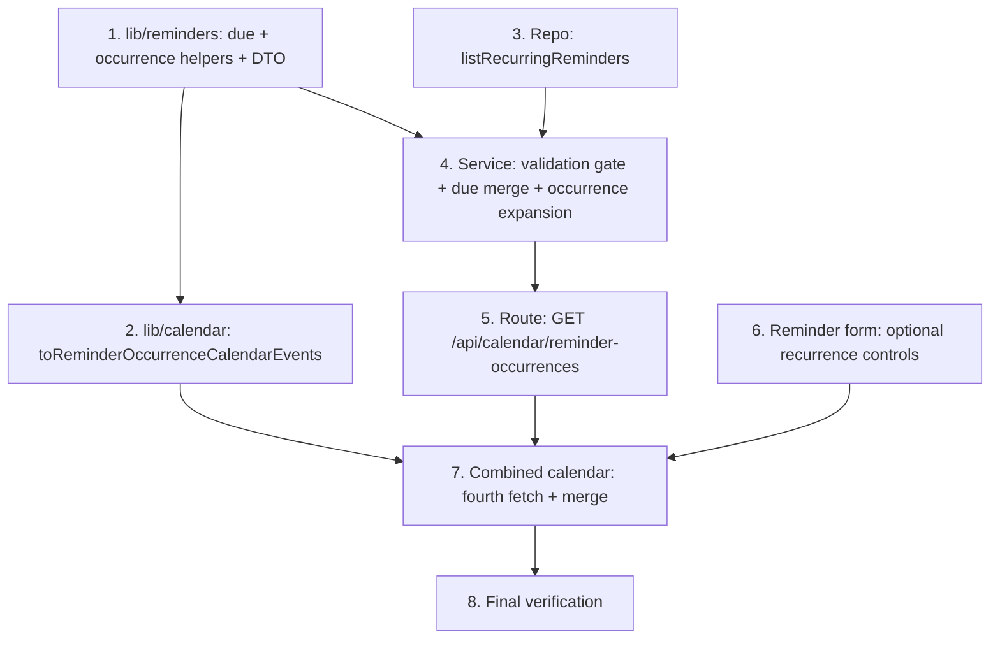

# Implementation Plan

## Overview

Implementation of `recurring-reminders`: a reminder can carry the habit
recurrence rule, the bell surfaces its current occurrence via the
`reminderSeenAt` watermark, and recurring reminders expand into markers on the
calendar reminder layer. Bottom-up: pure due/occurrence helpers + the calendar
mapper and the repository read first, then the service (validation gate + due
merge + occurrence expansion), the new range endpoint, the reminder form
recurrence controls, and the calendar wiring, closing with full verification.
No schema changes; reuses `generateOccurrences`, the recurrence columns, and
`reminderSeenAt`.

## Task Dependency Graph



```json
{
  "waves": [
    { "wave": 1, "tasks": ["1", "3", "6"] },
    { "wave": 2, "tasks": ["2", "4"] },
    { "wave": 3, "tasks": ["5"] },
    { "wave": 4, "tasks": ["7"] },
    { "wave": 5, "tasks": ["8"] }
  ]
}
```

## Tasks

- [x] 1. Pure recurring-reminder helpers + occurrence DTO
  - Add to `src/lib/reminders.ts`: `ReminderOccurrenceDTO`, `hasRecurrenceRule(rule)`, `reminderOccurrenceInstant(date, timeMinutes)`, `currentReminderOccurrence(rule, now)` (bounded lookback), and `isRecurringReminderDue(rule, seenAt, now)`. Reuse `RecurrenceRule`/`generateOccurrences` from `src/lib/habits.ts`.
  - Add property tests in `src/lib/reminders.test.ts` (fast-check): Property 1 (due predicate), Property 2 (dismiss re-arms), Property 3 (current occurrence is the latest ≤ now), plus edge cases (no occurrence before now; watermark exactly at the instant → not due).
  - _Requirements: 3.1, 3.2, 3.3, 4.1, 4.2_

- [x] 2. Calendar mapper for recurring-reminder occurrences
  - Add `toReminderOccurrenceCalendarEvents(rows)` to `src/lib/calendar.ts`: point/all-day `kind: "reminder"` markers, `id = "{reminderId}:{date}"`, category/color, drops invalid dates. Import `ReminderOccurrenceDTO`.
  - Add tests in `src/lib/calendar.test.ts` (mapping shape + drops invalid date).
  - _Requirements: 5.1, 5.2, 5.5_

- [x] 3. Repository: list recurring reminders
  - Add `listRecurringReminders(userId)` to `src/repositories/planning-item.repository.ts`: `recordatorio`-key, live, with a rule (`recurrenceDays` non-empty OR `recurrenceInterval` not null), joined to `List → Category`, flattened to `ScheduledItemWithCategory`.
  - Add integration tests: returns only live recordatorio WITH a rule; excludes one-shot/deleted/archived/other users; includes category.
  - _Requirements: 3.5, 5.1, 6.4_

- [x] 4. Service: validation gate, due merge, and occurrence expansion
  - Extend `validateRecurrenceRule` gating so it also runs for a `recordatorio` WHEN a recurrence rule is present (days non-empty or interval set); skip when absent; habits unchanged.
  - Extend `listDueRemindersForCurrentUser` to merge the one-shot due set with recurring reminders that are due (`isRecurringReminderDue`), returning each recurring row with `remindAt` overwritten by its current occurrence instant.
  - Add `listReminderOccurrencesForCurrentUserRange(from, to)` returning `ReminderOccurrenceDTO[]` (reuse `listRecurringReminders` + `generateOccurrences`).
  - Add service tests (repo mocked): due merge, occurrence expansion (Property 4, model-based), validation rejects an invalid recordatorio rule and skips when no rule.
  - _Requirements: 2.1, 2.2, 2.3, 2.4, 2.5, 3.1, 3.4, 4.4, 5.1, 6.4_

- [x] 5. Route: `GET /api/calendar/reminder-occurrences`
  - Add `src/app/api/calendar/reminder-occurrences/route.ts`, thin, mirroring `/api/calendar/habits`: reuse `rangeSchema` + shared `mapErrorToResponse`; call `listReminderOccurrencesForCurrentUserRange`; 200 with the DTO array.
  - Add route tests: 200 with data, 400 missing/invalid range, 401 unauthenticated, 500 no-leak.
  - _Requirements: 5.1, 3.5_

- [x] 6. Reminder form: optional recurrence controls
  - Extend the reminder create/edit dialog (the `recordatorio` flow in `src/components/tasks/*`) with an OPTIONAL recurrence rule (weekday multi-select + time-of-day + "every N days"), identical in shape to the habit form controls. When empty → one-shot `remindAt` (unchanged); when set → send recurrence fields and omit `remindAt`. Keep interval/time as string fields converted on submit (repo gotcha). Mobile-first, ≥44px targets, accessible toggle group.
  - _Requirements: 1.1, 1.2, 1.3, 2.5_

- [x] 7. Combined calendar: fetch + merge recurring-reminder occurrences
  - In `combined-calendar.tsx`, add a fourth parallel fetch (`/api/calendar/reminder-occurrences`), map with `toReminderOccurrenceCalendarEvents`, and append to the merged events. Existing Reminders + category filtering already covers them (`kind: "reminder"`).
  - _Requirements: 5.1, 5.2, 5.3, 5.4, 6.1_

- [x] 8. Final verification
  - Run `tsc`, lint, the full test suite, and the production build; fix any failures so all gates are green.
  - _Requirements: 1.1, 2.5, 3.1, 4.1, 5.1, 6.1_

## Notes

- Property numbers reference the "Correctness Properties" section of `design.md`.
- The repository is the sole Prisma boundary; recurring-reminder due + expansion
  reuse `listRecurringReminders` with NO new query beyond it, and no schema change.
- Additive: one-shot reminders, habits, `/api/calendar`, and `/api/calendar/reminders`
  are unchanged. Watermark reuses `reminderSeenAt`; no acknowledge change needed.
- Out of scope (future): per-occurrence acknowledgement history, snooze, RRULE.
