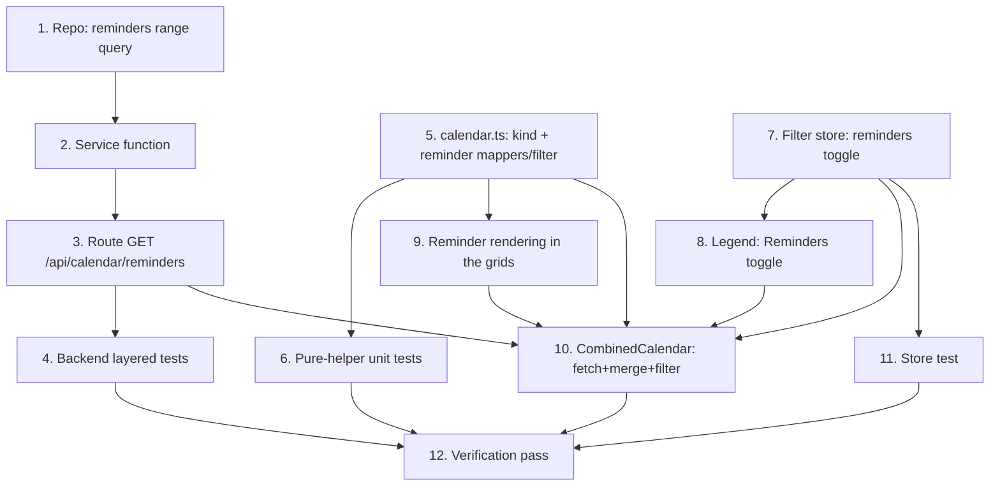

# Implementation Plan

## Overview

Add a reminder layer to the combined calendar. Work splits into a **backend**
track (a `remindAt`-windowed range query joined to the category, its service,
route, and tests), a **pure-logic** track (a `kind` discriminator on
`CalendarEvent`, a reminder mapper, and a layer filter — all unit-tested), and a
**UI** track (a reminder-layer toggle in the filter store + legend, distinct
reminder rendering in the three grids with non-draggable markers, and the
container fetching + merging both layers). No schema changes — `remindAt` exists
and the `List → Category` join + `ScheduledItemWithCategory` shape are reused.

## Task Dependency Graph



```json
{
  "waves": [
    { "wave": 1, "tasks": ["1", "5", "7"] },
    { "wave": 2, "tasks": ["2", "6", "8", "9", "11"] },
    { "wave": 3, "tasks": ["3"] },
    { "wave": 4, "tasks": ["4", "10"] },
    { "wave": 5, "tasks": ["12"] }
  ]
}
```

## Tasks

### Phase 1 — Backend and pure foundations

- [x] 1. Add the reminders range query to the repository
  - In `src/repositories/planning-item.repository.ts`, add `listRemindersForUser(userId, from, to): Promise<ScheduledItemWithCategory[]>`, modeled on `listScheduledItemsForUser` but filtering by reminder time: `where` = `userId`, `deletedAt: null`, `archived: false`, `remindAt: { not: null, gte: from, lt: to }`, live `list` + `category: { userId, deletedAt: null }`. Use `include: { list: { select: { category: { select: { id: true, name: true, color: true } } } } }`, flatten each row to `ScheduledItemWithCategory` (spread `PlanningItem` fields + `categoryId`/`categoryName`/`categoryColor`). Order `remindAt asc`. Do NOT filter by `reminderSeenAt` or `remindAt <= now` (the calendar shows all reminders in the window).
  - _Requirements: 4.1, 4.2, 4.3, 4.6, 1.6_

- [x] 5. Add the reminder discriminator, mapper, and layer filter
  - In `src/lib/calendar.ts`: add `kind?: "scheduled" | "reminder"` to `CalendarEvent`. Add `toReminderCalendarEvents(rows: ScheduledItemWithCategory[]): CalendarEvent[]` mapping each row with a valid `remindAt` to a POINT event (`startAt = new Date(row.remindAt)`, `endAt = null`, `allDay = false`, `kind = "reminder"`, plus `description`, `itemTypeId`, `categoryId`, `categoryName`, and `color = resolveCategoryColor(row.categoryColor, row.categoryId)`); skip rows with a null/NaN `remindAt`. Add `filterReminderLayer(events, hidden): CalendarEvent[]` returning `hidden ? events.filter(e => e.kind !== "reminder") : events`. Do NOT modify `eventsOnDay`/`groupEventsByDay`/`layoutDayEvents`/`filterVisibleEvents`.
  - _Requirements: 1.1, 1.4, 1.6, 2.2, 2.3_

- [x] 7. Add the reminder-layer toggle to the filter store
  - In `src/stores/calendar-filter-store.ts`, add `remindersHidden: boolean` (default `false` = shown) and `toggleReminders: () => void` (flips it). Keep it session-scoped/in-memory alongside the existing category state; do not touch the category members.
  - _Requirements: 2.1, 2.4, 2.5_

### Phase 2 — Service, pure tests, store test, and presentational pieces

- [x] 2. Add the reminders range service function
  - In `src/services/planning-item.service.ts`, add `listRemindersForCurrentUserRange(from, to): Promise<ScheduledItemWithCategory[]>` that resolves the acting user via `getCurrentUserId()` and delegates to `listRemindersForUser`. No category-ownership precheck (already user-scoped). Mirror `listScheduledItemsForCurrentUserRange`.
  - _Requirements: 4.1, 4.5, 4.6_

- [x] 6. Unit-test the pure helpers
  - Extend `src/lib/calendar.test.ts`: `toReminderCalendarEvents` (point event at `remindAt` with `endAt` null / `kind` "reminder" / `allDay` false, attaches categoryId/name/color, drops null/invalid `remindAt`, keeps acknowledged reminders); `filterReminderLayer` (hidden → drops only reminder-kind events, shown → returns all, scheduled events never removed); `filterVisibleEvents` with a reminder-kind event carrying a hidden `categoryId` (excluded, proving reminders inherit the category filter).
  - _Requirements: 1.1, 1.4, 1.6, 2.2, 2.3, 2.6_

- [x] 8. Add the Reminders toggle to the legend
  - In `src/components/calendar/category-legend.tsx`, after the category chips render one more chip: a "Reminders" toggle with a `Bell` icon (`lucide-react`), `aria-pressed={!remindersHidden}`, `onClick={toggleReminders}`, dimmed/struck-through when hidden (mirror the category chip styling). Render this chip even when there are no categories (return the toggle row instead of `null`), so the reminders control is always present. Read `remindersHidden`/`toggleReminders` from `useCalendarFilterStore`.
  - _Requirements: 2.1, 2.4_

- [x] 9. Render reminder markers distinctly in the grids
  - `month-grid.tsx`: in `EventChip`, when `event.kind === "reminder"`, prefix a small `Bell` icon and use a distinct treatment (e.g. dashed/bell accent) while keeping the category color and the time·title label. `time-grid.tsx`: make draggability per-event — in `TimedEvent` compute `canDrag = draggable && positioned.event.kind !== "reminder"` and only attach pointer handlers / grab cursor when `canDrag`; render a reminder block with a `Bell` icon and a marker-like style; a reminder always peeks on click, never drags. `agenda-list.tsx`: when `event.kind === "reminder"`, prefix a `Bell` icon on the row. Scheduled rendering must stay unchanged in all three.
  - _Requirements: 1.2, 1.3, 3.1, 3.2_

- [x] 11. Test the filter store reminder toggle
  - Extend `src/stores/calendar-store.test.ts` (or add `calendar-filter-store.test.ts`): `remindersHidden` defaults to `false`; `toggleReminders()` flips it true→false→true; toggling reminders does not mutate `hiddenCategoryIds`, and toggling a category does not mutate `remindersHidden`.
  - _Requirements: 2.4, 2.5_

### Phase 3 — Route

- [x] 3. Add the reminders range route
  - Create `src/app/api/calendar/reminders/route.ts` mirroring `src/app/api/calendar/route.ts`: the same `rangeSchema` (`from`/`to` coerced dates, `to > from`) and `mapErrorToResponse` contract (ZodError → 400, ValidationError → 400, UnauthorizedError → 401, NotFoundError → 404, else 500). `GET` parses the range from the query string, calls `listRemindersForCurrentUserRange`, returns the array with 200. Thin — no Prisma, no business logic.
  - _Requirements: 4.1, 4.4, 4.5_

### Phase 4 — Backend tests and container

- [x] 4. Add backend layered tests for the reminders range
  - Repository (`planning-item.repository.test.ts`): `listRemindersForUser` — returns in-window reminders across categories with category id/name/color; excludes future/out-of-window `remindAt`, deleted, archived, and other users; INCLUDES an acknowledged (`reminderSeenAt` set) reminder; ordered by `remindAt asc`. Use the stable seeded categories with idempotent cleanup (mirror the `listScheduledItemsForUser` suite). Service (`planning-item.service.test.ts`): `listRemindersForCurrentUserRange` delegates with the resolved user + window. Route: create `src/app/api/calendar/reminders/route.test.ts` (200 with data, 400 on missing/invalid range, 401 unauthenticated) mirroring `src/app/api/calendar/route.test.ts`.
  - _Requirements: 4.1, 4.2, 4.3, 4.4, 4.5, 4.6, 1.6_

- [x] 10. Wire the reminder layer into the CombinedCalendar container
  - In `src/components/calendar/combined-calendar.tsx`: fetch BOTH `/api/calendar` and `/api/calendar/reminders` for the current `[from, to)` in parallel (`Promise.all`); map with `toCombinedCalendarEvents` / `toReminderCalendarEvents`; set a single merged `events` array. Read `remindersHidden` from `useCalendarFilterStore`. Compute visible events as `filterReminderLayer(filterVisibleEvents(events, hiddenCategoryIds), remindersHidden)` (memoized). Leave `handleReschedule` unchanged (only scheduled events are draggable). On a failure of either fetch, show the existing non-blocking error toast and render what loaded. The detail peek already handles a point event (reminder → date · time).
  - _Requirements: 1.1, 1.5, 1.7, 2.2, 2.6, 3.2, 5.1_

### Phase 5 — Verification

- [x] 12. Full verification pass
  - `pnpm exec tsc --noEmit`, `pnpm lint`, `pnpm test`, `pnpm build` all green (clear `.next` on a stale route type error). Manual smoke test: on `/calendar` a reminder shows as a bell marker at its time in month/week/day/agenda; it is colored by category; an item with both a schedule and a reminder shows two markers; an acknowledged reminder still shows; the Reminders toggle hides/shows the whole layer (default on) and survives view/period nav; hiding a category also hides its reminders; a reminder marker is not draggable but peeks on click with its remind time; `/api/calendar` and the per-category calendar are unchanged.
  - _Requirements: 1.1, 1.2, 1.5, 1.6, 2.2, 2.4, 2.6, 3.1, 3.2, 5.1, 5.2_

## Notes

- **Reminder = point event + one discriminator**: `kind` lets reminders reuse
  every layout/bucketing helper unchanged; only new mappers and grid branches.
- **Separate endpoint, parallel fetch**: the scheduled query stays untouched; the
  client merges the two layers and filters them (category + reminders toggle).
- **Calendar shows ALL reminders** (no `reminderSeenAt`/`now` filter); the bell
  keeps its due/unacknowledged predicate — two different lenses on `remindAt`.
- **Read-only markers**: reminders are non-draggable; `remindAt` is edited in the
  task dialog. Per-event draggability is the only `TimeGrid` behavior change.
- **Pattern seed**: this layer+toggle approach is what objectives/habits will
  reuse later.
- **Workflow**: commit to `main`, conventional commits, no AI attribution, keep
  the suite green; numbering follows the dependency waves.
