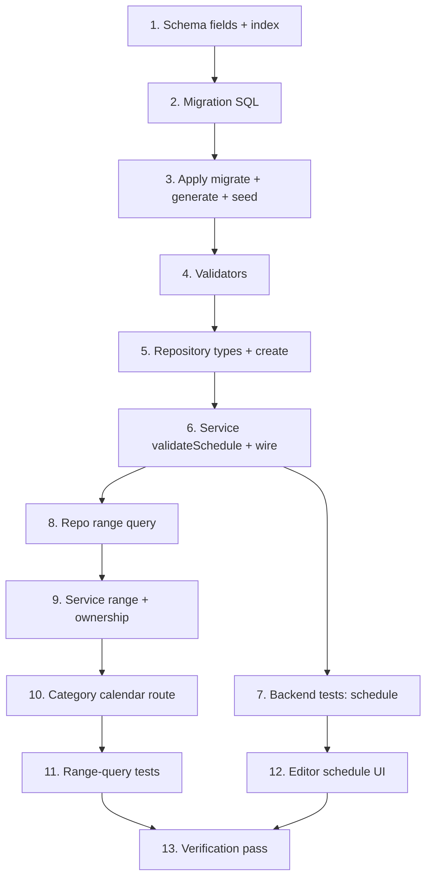

# Implementation Plan

## Overview

Incremental plan to add the scheduling model. Backend-first (schema → migration
→ validators/repository/service → tests), then the category range-query API,
then the editor UI, then a full verification pass. Each phase keeps the app
building and green so it can be committed as a reviewable unit. No Zustand or
calendar UI here — those are later specs.

## Task Dependency Graph



```json
{
  "waves": [
    { "wave": 1, "tasks": ["1"] },
    { "wave": 2, "tasks": ["2"] },
    { "wave": 3, "tasks": ["3"] },
    { "wave": 4, "tasks": ["4"] },
    { "wave": 5, "tasks": ["5"] },
    { "wave": 6, "tasks": ["6"] },
    { "wave": 7, "tasks": ["7", "8"] },
    { "wave": 8, "tasks": ["9", "12"] },
    { "wave": 9, "tasks": ["10"] },
    { "wave": 10, "tasks": ["11"] },
    { "wave": 11, "tasks": ["13"] }
  ]
}
```

## Tasks

### Phase 1 — Data layer

- [x] 1. Add scheduling fields to the Prisma schema
  - In `src/prisma/schema.prisma`, add to `PlanningItem`: `startAt DateTime? @map("start_at")`, `endAt DateTime? @map("end_at")`, `allDay Boolean @default(false) @map("all_day")`, and `@@index([startAt])`.
  - _Requirements: 1.1_

- [x] 2. Write the scheduling migration
  - Create `src/prisma/migrations/<timestamp>_planning_items_scheduling/migration.sql` (timestamp after the latest existing migration). Add columns `start_at`/`end_at` (`TIMESTAMP(3)`), `all_day` (`BOOLEAN NOT NULL DEFAULT false`), and `CREATE INDEX "planning_items_start_at_idx" ON "planning_items" ("start_at")`. Additive, non-destructive.
  - _Requirements: 1.1, 5.1_

- [x] 3. Apply the migration and regenerate the client
  - Run `pnpm db:migrate`, `pnpm db:generate`, then `pnpm db:seed`; confirm the seed still succeeds and existing rows are unscheduled.
  - _Requirements: 1.1, 5.1_

### Phase 2 — Validation and persistence

- [x] 4. Add schedule fields to the planning-item validators
  - In `src/validators/planning-item.schema.ts`: add `startAt`/`endAt` (`z.coerce.date()`) and `allDay` (`z.boolean()`) to `createPlanningItemSchema` (optional) with a `.refine` enforcing "`endAt` requires `startAt`" and "`endAt >= startAt`". Add the same fields to `updatePlanningItemSchema` as `.nullable().optional()` (no cross-field refine — the service validates the effective schedule).
  - _Requirements: 1.1, 2.1, 2.2, 2.3, 3.3_

- [x] 5. Extend the planning-item repository for schedule fields
  - In `src/repositories/planning-item.repository.ts`: add `startAt?: Date | null`, `endAt?: Date | null`, `allDay?: boolean` to `CreatePlanningItemData` and `UpdatePlanningItemData`; ensure `createPlanningItem` persists them (defaulting null/false).
  - _Requirements: 1.1, 1.2_

- [x] 6. Add schedule validation and wiring in the service
  - In `src/services/planning-item.service.ts`: add a pure `validateSchedule(startAt, endAt)` throwing `ValidationError` on "`endAt` without `startAt`" or "`endAt < startAt`". Call it in create (incoming values) and in update against the EFFECTIVE schedule (existing row merged with the patch, honoring explicit `null` as clear); clearing `startAt` also clears `endAt`. Do not touch `dueAt`.
  - _Requirements: 1.2, 1.3, 2.1, 2.2, 2.3_

- [x] 7. Backend tests for scheduling validation
  - Validator: create rejects `endAt` without `startAt` and `endAt < startAt`; accepts point and all-day; update accepts explicit `null`. Service: `validateSchedule` edge cases, effective-schedule on update (add `endAt` to an item with stored `startAt`; reject `endAt` before stored `startAt`), clearing `startAt` clears `endAt`, `dueAt` untouched. Route: `PATCH /api/planning-items/[id]` → 400 inconsistent, 200 valid.
  - _Requirements: 1.3, 2.1, 2.2, 2.3_

### Phase 3 — Category range-query API

- [x] 8. Add the category range query to the repository
  - In `src/repositories/planning-item.repository.ts`: add `listScheduledItemsByCategory(categoryId, from, to)` returning non-deleted items with a non-null `startAt` whose schedule overlaps `[from, to)` (`startAt < to AND coalesce(endAt, startAt) >= from`), joined through `list: { categoryId, deletedAt: null, category: { userId, deletedAt: null } }`.
  - _Requirements: 4.1, 4.4, 4.5_

- [x] 9. Add the range service with ownership check
  - In `src/services/planning-item.service.ts`: add `listScheduledItemsForCategory(categoryId, from, to)` — resolve current user, assert category ownership via `findOwnedCategory` (throw `NotFoundError` if not owned/absent), delegate to the repository.
  - _Requirements: 4.2, 4.5_

- [x] 10. Add the category calendar route
  - Create `src/app/api/categories/[id]/calendar/route.ts` with `GET`: parse `from`/`to` (`z.coerce.date()`), validate `to > from` (else `ValidationError` → 400), delegate to `listScheduledItemsForCategory`, reuse the shared `mapErrorToResponse` (400/401/404/500).
  - _Requirements: 4.1, 4.2, 4.3_

- [x] 11. Tests for the range query
  - Repository (real DB): returns only scheduled, in-range, same-category items; excludes unscheduled and soft-deleted; includes a multi-day overlap case crossing the window boundary. Service: `NotFoundError` for a non-owned category. Route: 400 for missing/invalid range, 404 for a non-owned category, 200 with expected items.
  - _Requirements: 4.1, 4.2, 4.3, 4.4, 4.5_

### Phase 4 — Editor UI

- [x] 12. Add schedule controls to the task edit dialog
  - In `src/components/tasks/task-edit-dialog.tsx`: add a "Schedule" section — an `allDay` checkbox plus start/end inputs (`datetime-local` when not all-day, `date` when all-day). Convert to/from ISO on submit; extend `TaskEditPayload` with `startAt?: string | null`, `endAt?: string | null`, `allDay?: boolean`. Pre-fill from the task; clearing the start clears the schedule; show a client-side message when end precedes start and block submit. `TaskList.handleUpdate` forwards the payload unchanged.
  - _Requirements: 3.1, 3.2, 3.3, 3.4, 3.5_

### Phase 5 — Verification

- [x] 13. Full verification pass
  - `pnpm build`, `pnpm test`, `pnpm lint`, `pnpm exec tsc --noEmit` all green (clear `.next` if a stale cache error appears). Confirm the migration applied and the seed runs. Manual smoke test of the editor schedule controls (set start/end, all-day, clear, invalid end<start).
  - _Requirements: 1.1, 2.1, 2.2, 3.2, 3.4, 4.1, 4.3, 5.1_

## Notes

- **UTC vs local time**: timestamps are stored in UTC; the editor converts
  to/from the browser's local time. This is the classic off-by-hours trap —
  keep conversion at the UI boundary only.
- **Effective-schedule validation**: partial PATCH payloads mean cross-field
  rules must be checked in the service against the merged (existing + patch)
  values, not in the update schema. See design "Key decisions".
- **No Zustand / no calendar UI here**: those belong to the dashboard and
  calendar specs. This spec only lays the temporal data + editor + range API.
- **Commit boundaries**: Phase 1-3 (backend + API) and Phase 4 (editor) are
  natural commit units. Conventional commits, no AI attribution. Keep the suite
  green at each boundary.
- **Migration is additive** and safe for existing data (no destructive step).
